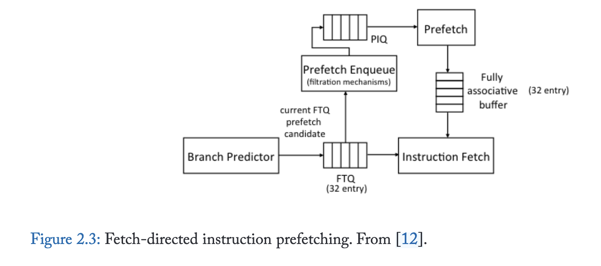
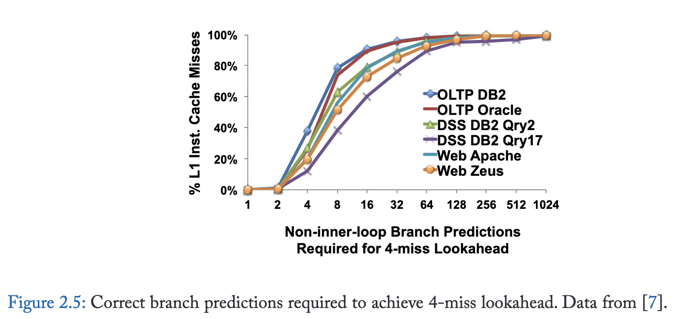
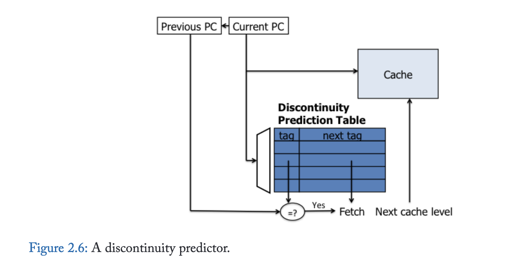
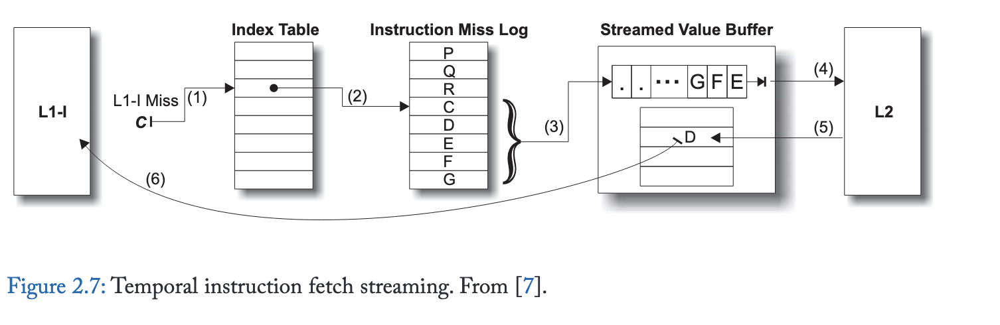

# 2. Instruction Prefetching

指令获取停顿对具有大指令工作负载的性能极为不利；当指令供应速度减慢时，处理器流水线的执行资源（无论多么丰富）将被浪费。尽管桌面和科学计算工作负载通常表现出较小的指令工作集，但传统服务器工作负载和新兴云工作负载的主要指令工作集往往远超上层缓存所能容纳的范围。随着快速软件开发、脚本化编程范式以及软件栈深度不断增加的虚拟化环境的发展趋势，主要指令工作集也在迅速增长。现代硬件指令调度技术，如乱序执行，通常能有效隐藏因数据访问和其他长延迟指令引起的部分或全部停顿。然而，乱序执行通常无法隐藏指令获取延迟。因此，在服务器中，指令停顿往往占整体内存停顿的很大一部分。

## 2.1 Next-Line Prefetching

下一行预取[5]是指令预取的最简单形式，在大多数现代处理器设计中普遍存在。由于代码在内存中按顺序布局在连续的存储器地址上，指令缓存中超过一半的查找通常针对顺序地址。生成顺序地址并获取它们所需的逻辑极少，并且相当容易集成到处理器和缓存层次结构中。

## 2.2 Fetch-Directed Prefetching (FDIP)

下一行预取器非常高效，但仅有一半的指令查找是顺序的。控制流指令会打破顺序取指并造成间断，因此需要预测未来控制流并进行前瞻。

尽管FDIP能有效减少指令获取延迟，但其预取前瞻能力存在根本性局限。图2.5量化了分支预测带宽与预取前瞻能力的关系：近半数指令缓存缺失需要连续16次以上正确分支预测（不含内循环分支）才能生成候选预取地址。

## 2.3 Discontinuity Prefetching

更严峻的挑战在于获取断点处的预取——即由函数调用、条件分支跳转和陷阱导致的顺序指令获取序列中断。

针对控制流非连续性存在多种解决方案。错误路径预取[16]是一种通过使用分支预测器但预测相反路径来解决FDIP基础问题的简单方法。尽管效果有限，预测错误路径能够越过数据相关分支进行预取，并且通过后向循环分支的出口可以预取到FDIP无法获取的指令。

基于分支历史的预取器[17]、基于执行历史的预取器[18]、多流预测器[10]、下一条踪迹预测器[19]以及调用图预取[20]等技术，均通过前序指令作为索引来预测非连续性，其追踪机制独立于分支预测器。基于服务器应用具有深层重复函数调用栈的观察，调用图预取[20]致力于同时预测整个调用栈的走向，而不仅仅是下一个非连续点。

该方案的最新实例是非连续性预测器[21]（如图2.6所示），其维护了一个取指非连续性映射表，将包含已执行分支的程序计数器映射至分支目标。据传某些商用处理器产品中已有类似实现。当下一行指令预取器在取指单元前方探索时，会使用每个块地址查询非连续性表，若匹配成功，则除了顺序路径外还会预取非连续路径。虽然该方案简单且硬件需求极低，但非连续性预测器仅能跨越单次取指非连续性；若通过递归查找探索更多路径，会导致预取块数呈指数级增长。最多遍历一个非连续点的限制约束了预取器的前瞻能力。此外，由于每个缓存块仅能记录一个非连续点，而当指令块内存在多个已执行分支时，其覆盖范围将受到限制。

## 2.4 Prescient Fetch

利用空闲或并行资源进行指令预取已被提出。预知式预取技术 [22, 23, 24, 25] 使用辅助线程来识别关键计算和控制转移，并提前执行这些操作，以辅助运行较慢且与辅助线程并行执行的主线程。尽管这些方法可用于超越循环和函数调用的指令预取，但只有预知指令预取 [22] 是专门为此目的设计的。推测式线程技术识别所需的关键执行信息，并利用该信息领先于主线程发起指令预取。虽然推测式线程技术能够跨越多个取指间断点，但其前瞻能力仍然有限，因为它们以单个指令的粒度遍历未来指令流，因此通常需要遍历大量指令才能发现新的预取缓存块。

## 2.5 Temporal Instruction Fetch Streaming (TIFS)

时序指令取指流（TIFS）[7] 旨在解决辅助线程和基于取指/间断点机制的前瞻局限性。TIFS 不探索程序的控制流图，而是通过记录并重放重复出现的 L1 指令缺失序列，直接预测未来的指令缓存缺失。

图 2.7展示了 TIFS 的设计。L1 指令缓存缺失被记录在指令缺失日志中，这是一个循环缓冲区，可在专用存储区或 L2 缓存内维护。独立的索引表保存从指令块地址到该地址在日志中最后记录位置的映射。对地址 C 的 L1-I 缺失会查询索引表 (1)，该表指向指令缺失日志中的一个条目 (2)。紧随 C 之后的地址流从日志中读取，缓存块地址被发送到流式值缓冲区 (3)。流式值缓冲区向 L2 请求流中的块 (4)，L2 返回内容 (5)。之后，在后续对 D 的 L1-I 缺失时，缓冲区将内容返回给 L1-I (6)。

## 2.6 RAS-Directed Instruction Prefetching (RDIP)

传统取指导向预取器因无法预测循环返回分支和不可控条件分支而受限。非连续性预取器虽解决这些局限，但仅依赖单个PC值预测后续取指非连续性。同样，尽管TIFS增强了预读能力，仍仅维护从缓存块到日志位置的单一指针。这两种机制在遇到缓存块存在多控制流路径时都会失准，返回指令和switch语句等常见模式就会产生多路径。

返回地址栈导向指令预取（RDIP）[26] 利用额外程序上下文信息提升预测精度与预读能力。其设计基于两点发现：（1）调用栈捕获的程序上下文与L1指令缓存未命中强相关；（2）现有高性能处理器中的返回地址栈（RAS）可精炼概括程序上下文。RDIP将预取操作与RAS内容构成的签名 关联，把签名及对应预取地址存入约64KB的签名表。每次调用和返回操作时查询该表触发预取，最终实现理想L1缓存潜在加速效果的70%，在服务器工作负载套件上较无预取基准提升11.5%。

## 2.7 Proactive Instruction Fetch

TIFS 融合了逐行预取器的顺序访问预测能力，但其性能优势更为显著，因为预测更精准、更及时。准确性的提升源于 TIFS 使用历史记录来确定需要预取的连续后续块数量。

TIFS 通过多种方式提升预读能力：首先，它以缓存块粒度而非单条指令进行操作，解决了辅助线程方法的关键局限。因此，它可以跳过缓存块内的局部循环和次要控制流。通过将非连续分支和间接跳转目标单独记录为指令流组成部分，TIFS 能够支持任意数量的非连续分支。此外，由于记录了指令缓存未命中的扩展序列，它能快速预测远期指令，实现显著更强的预读能力。例如，逐行预测器仅能在访问函数首指令块后正确预取函数体，而 TIFS 通过预测函数调用及其在进入函数前的顺序访问，能在调用方执行至调用点前就提前预测并预取相同指令块。

除了无法区分程序上下文外，TIFS 的预测准确性还受到其他控制不规则性的影响，这些不规则性导致 L1 指令缓存缺失序列出现细微差异。具体而言，原本重复的指令流可能因缓存替换的微小差异、沿误预测分支路径的指令预取影响，以及异步中断和操作系统陷阱的影响而被分割或过滤。主动指令预取 [27] 对 TIFS 设计进行了改进，以（1）记录已提交指令序列访问的缓存块序列（而非缓存缺失的指令预取），并（2）单独记录在中断/陷阱处理程序上下文中执行的流。该设计的一个关键创新是采用位向量对指令序列进行压缩表示，从而高效编码预取地址间的空间局部性。**后续研究 [28] 将预取器元数据集中存储于多核共享的结构中，这在元数据被多核共享的同构设计中显著降低了存储成本。集中化将每核元数据降至最小容量，使得预取器即便在采用小核（例如移动/嵌入式平台中的核心）的多核设计中也能实用。**

## 2.8 Conclusion

| 预取器名称      | 使用的关键信息                            | 预取深度                 | 准确率 | 面积       |
| --------------- | ----------------------------------------- | ------------------------ | ------ | ---------- |
| Next-Line       | 地址顺序性                                | 几个cache块              | 50%    | <1KB       |
| FDIP            | BPU产生的预测                             | 取决于其准确性           | >50%   | <1KB       |
| Discontinuity   | 预测程序的“断点”                          | 典型情况是提前一个分支   | >50%   | >1KB       |
| Prescient Fetch | 辅助线程                                  | 取决于辅助线程执行速度   | >50%   | >1KB       |
| TIFS            | 利用单次 L1miss 预测后续一系列 L1miss     | 不和cache blocks数量绑定 | 95%    | ~64K/core  |
| RAS-directed    | 利用上下文信息进一步区分时序流            | 同上                     | >95%   | ~64K/core  |
| Proactive-Fetch | 利用当前 L1 cache状态信息预测 L1miss 序列 | 同上                     | >99%   | ~256K/chip |