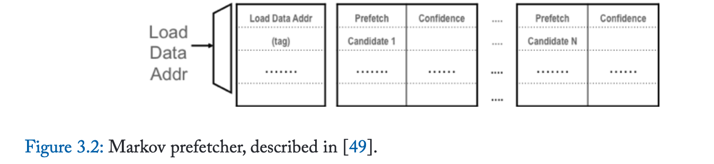
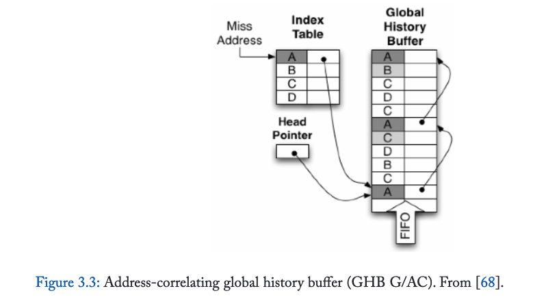
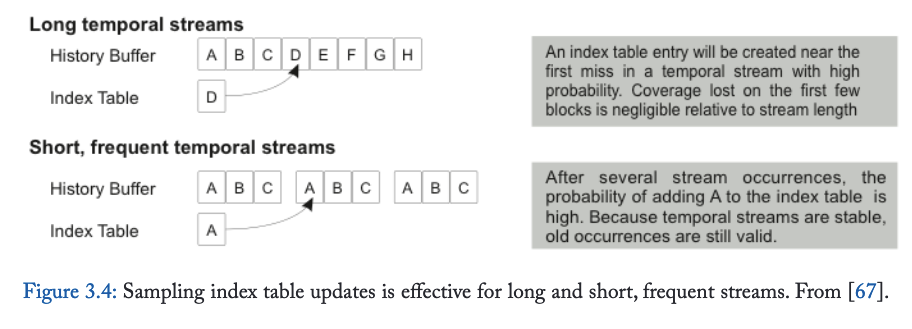
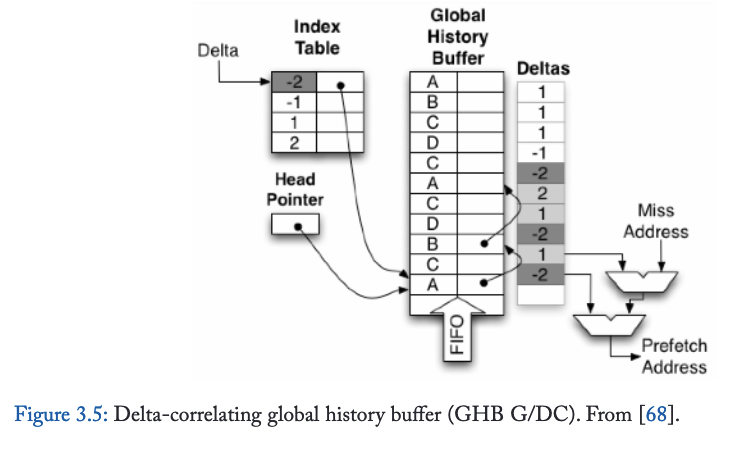
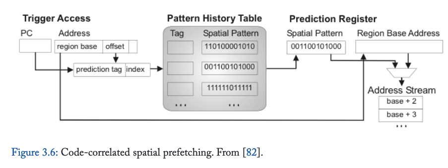
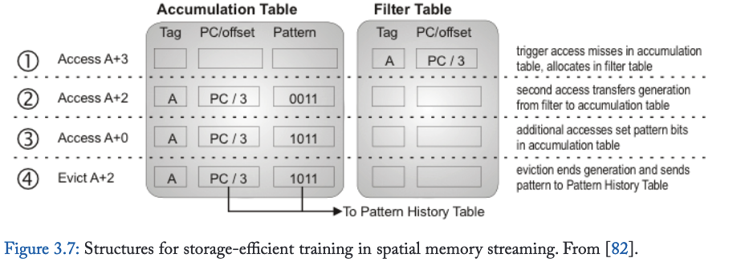

# 3. Data Prefetching

数据缺失模式源于算法和高级编程结构为组织和遍历内存数据所施加的内在结构。传统冯·诺依曼计算机系统中的指令缺失模式往往较为简单——遵循结构化控制流图中的顺序模式或重复控制转移，而数据访问模式则可能复杂得多，尤其是在支持多重遍历的指针链接数据结构中。此外，代码通常是**静态**的因而易于预取（除却近期可能干扰指令预取的虚拟化和即时编译机制），但数据结构会在执行过程中**动态变化**，导致遍历模式发生改变。这种访问模式的高度复杂性催生了远比指令预取器更丰富多元的数据预取方案设计空间。

我们将数据预取器的设计空间划分为四大类别。第一类是基于简单步长模式的预取器，这类预取器直接将逐行指令预取概念推广至数据领域。第二类依赖重复遍历序列，通常利用地址间的指针关联性。第三类依托规整（但可能非等距步长）的数据结构布局。最后一类则是突破传统乱序指令窗口的前瞻探索机制，其不依赖于内存访问地址流的规律性或重复性。

## 3.1 Stride and Stream Prefetchers for Data

我们研究的第一类数据预取器是步长与流预取器，它们是由指令预取中的逐行预取和流预取机制直接演化而来。这类预取器能捕捉在虚拟地址空间中连续分布或按固定步长间隔的数据访问模式，对密集矩阵和数组访问模式极为有效，但对基于指针的数据结构通常收效甚微。从古老的IBM System/370系列到现代高性能处理器，步长数据预取器已在工业处理器设计中广泛应用。直至近期，这类硬件数据预取器仍被认为是唯一实现商业部署的类别。

早在1978年就有文献[5]描述了仅支持连续地址块预取的顺序数据预取器实现。到1990年代初，此类预取器已扩展至能检测并预取非固定步长的访问序列[29]。这类步长访问模式在遍历多维数组时频繁出现，当聚合数据类型（例如C语言中的结构体）存储在数组中时会出现跨步访问。即使在使用指针的数据结构中，当动态内存分配器将固定大小的对象连续排列在内存中时（由于池分配器的普遍使用，这种情况很常见），跨步访问也可能偶然出现。Dahlgren和Stenstrom详细研究了顺序预取与跨步预取机制的优势与有效性[30]。

跨步预取器实现中的关键挑战在于区分多个交错的跨步序列，例如矩阵-向量乘法中可能出现的情况。图3.1展示了Baer和Chen基于单条加载指令跟踪跨步的方案示意图。其参考预测表是一个带标签的组相联结构，使用加载指令的程序计数器作为查找键。每个表项保存该加载指令最后引用的地址，以及前两次地址之间的差值（即跨步）。当连续两次观察到相同跨步时，系统将使用最后引用地址和跨步值计算一个或多个预取地址。后续持续匹配记录跨步的访问将触发更多预取操作。这种连续的跨步访问序列被称为流，与指令流预取器类似。Ishii等学者提出了能紧凑表示多重跨步的更复杂硬件结构[31]，而Sair团队则通过预测跨步长度将流预取扩展至更不规则的访问模式[32]。

第二个关键实现问题是确定检测到跨步流时应预取多少数据块。该参数通常称为预取度或预取深度，理想情况下应足够大以确保预取数据在处理器引用前到达，但又不能过大导致数据块在访问前被替换或对短流造成过度污染。Hur和Lin提出了能跟踪近期流长度直方图的简易状态机，可自适应确定每个独立流的合适预取深度，使得流预取器即使对仅含少数地址的短流也保持高效[33]。

传统上，跨步预取器将获取的数据直接存入缓存层次结构。但若预取过于激进，则可能污染缓存，置换掉有用数据。Jouppi[34]描述了一种替代架构：流预取器将数据存入称为流缓冲区的独立缓冲区，这些缓冲区在L1缓存之后或并行被访问。通过将数据置于流缓冲区，低准确度的流（即许多数据被预取但未被使用）不会置换缓存中的有用数据，从而降低错误预取的风险。但错误预取仍会消耗能量与带宽。Palacharla与Kessler评估了一种用流缓冲区完全替代二级数据缓存的内存系统架构[35]

每个流缓冲区容纳来自单一数据流的缓存块。处理器的访问请求会查询流缓冲区内容，通常与L1缓存访问并行执行。流缓冲区命中时，请求的缓存块通常会被转移至L1缓存，并预取该数据流的另一个缓存块。某些变体中，流缓冲区严格遵循先进先出原则，仅允许访问每个流缓冲区的头部。其他变体则采用关联搜索方式访问流缓冲区。当步长检测机制识别到新数据流时，整个流缓冲区会被清空并重新分配（丢弃陈旧数据流中所有未被引用的缓存块），通常采用轮转或最近最少使用策略。

## 3.2 Address-Correlating Prefetchers

步长预取器通常对基于指针的数据结构（如链表）效果有限，而本节讨论的第二类预取器专门针对此类数据结构的指针追踪访问模式设计。该类预取器不依赖内存中数据布局的规律性，而是利用算法倾向于以相同方式重复遍历数据结构的特性，从而产生重复出现的缓存缺失序列。

内存地址对访问之间的关联性早在1976年已被提出[38]。Charney与Reeves首次描述了利用此类成对关联关系的硬件预取器，并创造了“基于关联的预取器”这一术语[39,40]。后续研究将地址关联的概念从成对关系推广至访问组或访问序列[41,42]。Wenisch与合作者提出“时间关联”术语[42]，指代在时间上相邻被访问的两个地址未来倾向于再次被共同访问的现象。时间关联是“时间局部性”的类比——近期被访问的地址在不久后很可能再次被访问。缓存利用时间局部性，而地址关联预取器则利用时间关联。

### 3.2.1 Jump Pointers

关联预取器是针对指针追踪访问模式的硬件与软件机制的泛化。这些早期机制基于跳转指针概念[43,44,45,46]，即能在数据结构遍历中实现大跨度前向跳转的指针。例如，链表的节点可增加一个指向其后第十个节点的指针；预取器可通过追踪跳转指针，在主遍历进行时获得前瞻能力。由CPU执行，实现及时预取。基于跳转指针的预取器通常需要软件或编译器支持来标注指针。内容导向预取器[47, 48]避开标注机制，转而尝试解引用并预取任何构成有效虚拟地址的加载值。虽然跳转指针机制对特定数据结构遍历（如链表遍历）非常有效，但其主要缺陷在于：跳转指针推进遍历的距离必须精细平衡，既要提供足够的预读量，又不能跳过过多元素。跳转指针距离难以调优，且指针本身的存储开销可能很高。

### 3.2.2 Pair-Wise Correlation

本质上，基于关联的硬件预取器是一个查找表，它将某个地址映射到访问序列中可能紧随其后的另一个地址。这种关联不仅能捕获顺序访问和步长访问关系，更具普适性——例如能捕获指针地址与其指向地址之间的关系。正是捕获指针遍历的能力，使得地址关联预取器相比步长预取器具有更大的性能提升空间，因为指针追逐访问模式在现代处理器上的运行效率异常低下。然而，地址关联预取器依赖访问重复性：它们无法预取之前从未被访问过的地址（与步长预取器相反）。此外，地址关联预取器需要维护巨大状态量，需为每个地址存储其后继地址。因此其存储需求随应用程序工作集大小线性增长。地址关联预取器设计的创新重点大多集中于管理这种海量状态。

### 3.2.3 Markov Prefetcher

马尔可夫预取器[49, 50]是利用成对地址关联的最简预取器设计。它直接通过查找表实现将触发地址映射至片外访问序列中直接后继地址的机制。但由于地址（尤其以缓存块粒度考量）常参与多个遍历路径，仅存储单个后继地址会导致效果不佳。为此，马尔可夫预取器存储多个已观测到的后继地址，当触发地址发生缓存缺失时，**这些地址会被全部预取**。通过预取多个可能后继地址，马尔可夫预取器以牺牲准确率（正确预取数占总预取数的比例）来提升覆盖率（成功预取的需求缺失比例）——预取器发起的多个地址中仅有一个预期为正确地址。预取的后继地址数量常被称为预取宽度。

马尔可夫预取器采用由触发地址索引的片上组相联表结构（见图3.2）。表中每个条目包含待预取的后续地址集合及可选的置信度或置换策略信息，通常可存储四个后续地址。原始研究[49]提出使用1MB查找表，但随着应用数据足迹的扩大，所需查找表容量持续增长。后续研究表明，现代工作负载需要更大容量的表才能实现有效预取[51]。

**该设计灵感来源于对片外访问序列建立马尔可夫模型的构想。**模型中的每个状态对应一个触发地址，可能的后续状态对应相继的缺失地址。一阶马尔可夫模型中的转移概率对应各后续地址缺失的似然度。查找表的目标是为最常出现的触发地址存储具有最高转移概率的后续地址。然而现有硬件方案并未显式计算触发概率或转移概率，而是采用最近最少使用（LRU）启发式策略管理触发地址及其对应的后续地址。

马尔可夫预取器的效能受限于两个因素：

1. 由于仅尝试预测下一次缺失，其前瞻能力和内存级并行性受限；
2. 片上关联表容量限制了覆盖范围。

下文将探讨针对这些局限的改进方案。

### 3.2.4 Improving Lookahead via Prefetch Depth

马尔可夫预取器的首要局限在于有限的前瞻能力——即从触发地址到后续地址访问停滞的时间间隔过短，不足以掩盖预取数据的访问延迟。

提升前瞻能力的直接方法是预取更多地址，在预测的全局地址序列中提前更远距离[41]，这类似于增加流预取器的深度。在类马尔可夫预取器架构中，可通过基于初始预测地址递归执行查表操作来发起深度预取。但这种方法会导致高查表延迟，并急剧增加对马尔可夫表的带宽需求。此外，可能的预取候选数量会随预取深度呈几何级增长，因此需要制定适当的策略来限制这种增长以保持准确性。

另一种方案是，预取表可以折叠存储短序列（即流）的后继地址与每个预取触发地址相邻，而非执行连续查找[52, 53]。仍需采用合适策略来选择记录哪些后继流，例如最近或最高概率的后继地址。这种方法解决了查找延迟/带宽问题，但可能使表更新复杂化，因为一个地址可能需要记录在多个表项中（例如直接前驱、前驱的前驱等）。然而更深层的问题是：此类表结构必须将最大预取深度固定为每个表项中预留的存储容量。若预留存储过少，流会被截断，牺牲潜在的覆盖范围和前瞻能力；若深度设置过高，则会造成存储浪费，更严重的是，当流末尾记录无关地址时会导致准确性下降。多项研究表明，重复流的长度差异可达数量级，从少至两次到多达数千次缓存缺失[41, 42, 52, 54, 55]。我们将在后续讨论解决该问题的替代存储架构。通常，流起始处的头几次缓存缺失并不及时——触发缺失与后续块的访问时间间隔过近，无法实现及时预取。记录并预取这些地址既浪费存储空间，又会延迟流中有用块的预取。因此，跳过前几个地址，从能够获得延迟优势的第一个缺失处开始构建流是合理的。Chou及其合作者指出，在乱序执行核心中，指令窗口经常导致多个片外缺失并发产生[56]。当这组缺失被处理时，执行会陷入停滞。待这些缺失返回后，指令窗口得以推进，相关地址可被计算，使得下一组缺失能并行发出。他们将每组缺失的平均数量称为应用程序的内存级并行度。Chou基于此观察提出了基于时段关联预取机制[57]。在EBCP中，每个并行组（时段）内的首次缺失被用作触发地址，用于查找下一组（或后续组）的缺失，从而跳过在触发缺失发生时可能已在处理中的缺失地址。

### 3.2.5 Improving Lookahead via Dead Block Prediction (DBCP)

解决马尔科夫预取器前瞻限制的第二种方法是为每个预取操作选择更早的触发事件。死块预测[51, 54, 60, 61, 62]基于关键观察：缓存块在缓存中大部分时间处于死亡状态[63, 64, 65]——即它们虽保留在缓存中，但在失效或淘汰前不会被再次访问。死亡缓存块占据存储空间却无法再产生缓存命中。这正提供了机遇：预取器可用预取块替换死块，且无需承担缓存污染。死块关联预取器（DBCP）[51] 旨在预测对缓存块的最后一次访问（即其死亡事件），并以此作为触发条件预取将替换该死块的缓存块。从某种意义上看，DBCP 实现了最大前瞻性——它在缓存存储空间刚释放可接收预取块的第一时间就发起预取。

DBCP 依赖双重预测机制：**首先需预测缓存块的死亡时机**。死亡事件可通过代码关联[51,54,62]或时间追踪[61]进行预测。代码关联式死块预测通过识别缓存块被逐出前最后一条访问指令（即导致块死亡的访问点）实现，其核心原理是缓存块从初始缺失分配开始，到经历连续访问序列，直至最终死亡的整个过程中，往往会被相同的加载/存储指令序列访问。代码关联法的关键优势在于：从一个缓存块学习到的访问序列可泛化应用于预测其他地址的死亡事件。我们将在第3.3.3节详细讨论代码关联机制。

时序预测机制则通过预测缓存块的剩余存活时间（以时钟周期计量）而非具体死亡访问点来实现[61]。该方法的理论基础是：缓存块每次载入缓存时的存活周期具有相似性。在此类设计中，马尔可夫预取表会新增记录字段存储该块上次载入时的存活时长，并基于此设定适当安全边际（如两倍于前次存活时长）来预测块死亡时机。

**死亡事件预测完成后，还需确定替换该块的预取目标**。早期死块预取器采用类马尔可夫预测表实现该功能[51,61]，后续研究[54]则采用更复杂的时间流预测器（详见第3.2.9节）。

### 3.2.6 Addressing on-Chip Storage Limitations

制约马尔可夫预取器效能的第二个关键因素是关联表的有限片上存储容量。本质上，地址关联所需的元数据规模随应用程序工作集扩大而增长——理想情况下关联表需覆盖工作集内所有地址的关联关系。实际所需的关联表容量通常比数据集本身小一个常数系数（因存储的是地址而非数据，其存储需求较工作集缩小的比例为缓存块大小与地址尺寸之比）。

提升马尔可夫预取器效能的有效途径是**优化关联表的存储效率。**标签关联预取器[66]在关联表项中仅存储标签位而非完整缓存块地址，此举虽降低了单表项存储需求，但仅能通过微小常数因子提升关联表容量，这对于具有大工作集（例如服务器应用）的应用来说不足以获得高覆盖率。

第二种方法是**将关联表迁移至主内存**，从而消除片上关联表的容量限制[42, 52, 54, 67, 72]。片外关联表即使对于大工作集的负载也能实现高覆盖率[52]。然而，将关联表移至片外会使预取器元数据的访问延迟从几个时钟周期增加到片外内存访问的延迟——访问预取元数据因此可能耗时与预取所需缓存块一样长。

为保持高效，片外关联表必须提供足够的预瞻距离以隐藏长元数据访问延迟。一种方法（在第3.2.4节讨论）是设计预取器以记录未来并行组（周期）中发生的内存访问地址，如EBCP [57]所示。第二种方法是增加预取深度[52]；即使首个预取块不及时，后续地址仍能成功预取。增加预取深度的通用化形式是时序流[42]（在第3.2.9节讨论），它通过针对任意长度的流（即有效无限的预取深度）来分摊片外元数据访问[67]。

### 3.2.7 Global History Buffer

马尔可夫预取器的类缓存结构限制其仅能记录固定长度的流——单个表项只能存储固定预取深度的地址。窄表项会牺牲潜在的覆盖率和预瞻距离，而宽表项对于短流则存储效率低下。虽然可通过指针链式连接表项，但这会增加查找延迟，尤其当关联表位于片外时更为不利。Wenisch及其合作者研究了商业服务器应用中的重复时序关联流，并证明流长度从两个到数千个缓存块不等[55, 67]。最常见的流长度仅为两次缺失，这意味着宽马尔可夫表项存储效率低下。但若按流中的缺失次数加权（即通过预取该流可获得的潜在覆盖率），流长度中值约为十个缓存块。

Nesbit和Smith在其全局历史缓冲区[68]中引入的关键进展是将关联表拆分为两个结构：历史缓冲区（以循环缓冲区形式按发生顺序记录缺失序列）和索引表（提供从地址或其他预取触发到历史缓冲区位置的映射）。历史缓冲区允许单个预取触发指向任意长度的流。图3.3（引自[68]）展示了全局历史缓冲区的组织结构。

索引表保留了与原始马尔可夫预取器类似的组相联存储结构。但索引表不再存储缓存块地址，而是存储指向历史缓冲区的指针。当发生缺失时，GHB引用索引表以查看是否有与缺失地址关联的信息。若找到表项，则循指针定位至历史缓冲区中的对应位置，并检查历史缓冲区条目是否仍包含缺失地址（该条目可能已被覆盖）。若是，则历史缓冲区中的后续若干条目将包含预测流。历史缓冲区条目还可通过链接指针扩展至其他历史缓冲区位置，以实现按多种顺序遍历历史记录（例如，每个链接指针可指向同一缺失地址的先前出现位置，从而提升预取宽度与深度）。

通过改变索引表中存储的键值与历史缓冲区条目间的链接指针，GHB设计可挖掘触发事件与预测预取流间的多种关联特性。Nesbit与Smith提出了GHB变体的分类法GHB X/Y，其中X表示流局部化方式（即链接指针如何连接应连续预取的历史缓冲区条目），Y表示关联方法（即查找过程如何定位候选流）[68, 69]。局部化可分为全局局部化（G）与按PC局部化（PC）。在全局局部化下，连续记录的历史缓冲区条目构成流。每个历史表条目关联的指针或指向同一缺失地址的较早出现位置（如前文所述可提升预取宽度），或处于未使用状态。在按PC局部化下，索引表与链接指针均基于触发访问的PC连接历史缓冲区条目；通过追踪由同一触发PC发出的连续缺失地址间的链接指针形成流。关联方法可分为地址关联（AC）或差值关联（DC）。本节讨论全局地址关联变体（GHB G/AC），其索引表将缺失地址映射至历史缓冲区位置。第3.3.2节将讨论GHB PC/DC（“程序计数器局部化差值关联”），该变体通过不同方式定位条目并记录历史——基于连续缺失之间的步长构建历史记录，并按每指令地址（PC）定位缺失历史。文献中讨论了其他几种定位与关联方案[68, 69]。

GHB架构下的一个挑战在于判断流何时终止，即预取器何时应停止根据历史缓冲区指示继续获取地址。许多基于GHB架构的方案（如[42]）未尝试预测流的终止，而是为每次成功的索引表查找分配流缓冲区[34]，并在持续产生预取命中的情况下持续追踪该流。对已失效流分配的流缓冲区会通过最近最少使用置换等机制回收。Wenisch提出了在追踪流时自适应调整预取速率的方法[42]。

### 3.2.8 Stream Chaining

GHB的局限性在于常发现短流（尤其在按PC定位流时），难以实现足够的预取前瞻深度。通过辅助查找机制预测流间关联性[58, 59]，可将独立存储的流链式连接以扩展流长度。流链式连接将不同PC生成的流链接起来，形成更长的预取序列[59]。该技术基于连续PC定位流间存在时序关联性的洞察——即相同的两个流倾向于连续出现。更广义而言，可构建流间的有向图来指示每个前驱流最可能接续的后继流。流链式连接为每个索引表条目扩展了“下一流指针”（指示本流之后使用的索引表条目）和置信度计数器。通过链接独立的PC定位流，该技术能在单次触发访问中实现更准确的预取。

### 3.2.9 Temporal Memory Streaming

原始GHB方案的索引表和历史表容量较小且位于芯片上，这限制了GHB/AC变体对大工作负载场景的有效性。时序内存流处理技术[42]沿用GHB存储架构，但将索引表和历史缓冲区均移至主内存中，使其能记录并重放任意长度的流，即使面对大工作负载场景亦然。

片外表结构带来双重挑战：3.2.6节已讨论元数据访问延迟与预取前瞻深度的矛盾，但更新片外表同样存在挑战。由于每次缺失都需更新表结构，简单实现会使内存带宽增长两倍（一次缺失访问，外加索引表和历史缓冲区各一次更新）。

历史表更新带宽可通过片内小缓冲池及合并连续追加写入来缓解，而索引表更新则难以通过类似方式优化。空间局部性无法利用相同的优化。然而，Wenisch及其合作者指出，通过采用索引表更新采样技术——仅执行随机子集的历史表写入操作[67, 70]，可有效管理索引表更新带宽。研究表明，占据覆盖率主体的访问流通常具有长序列或高频复现特性。对于长序列流，在流起始的若干次访问内即有高概率记录索引表条目，相较于流的长主体部分仅牺牲可忽略的覆盖率；对于高频流，即使首次遍历时未记录索引表条目，随着流重复出现，目标条目的记录概率也会快速趋近于1。图3.4（引自[67]）直观展示了采样机制的有效性。

IBM近期披露其Blue Gene/Q系统采用了一种称为列表预取[71]的新方案，该方案与时序内存流预取技术高度相似，据我们所知是此类预取器唯一公开的商业实现。列表预取引擎可从主内存中记录的缺失流进行预取，地址列表既可通过软件API提供，也可由硬件自动记录。但该方案未提供片外索引表，需借助软件辅助完成流记录、定位与初始化操作，硬件则负责管理预取时效性及记录流与L1缓存缺失间的微小偏差。

### 3.2.10 Irregular Stream Buffer

虽然采样能降低片外流元数据维护开销，但查找延迟仍较高，限制了短流的预取前瞻距离。此外，片外存储无法实现类似GHB的地址关联流PC本地化——在片外历史缓冲区中沿链接指针遍历条目速度过慢（其效率不高于解引用依赖指针链，而这正是时态流预取旨在加速的访问模式）。为突破这些限制，Jain与Lin提出了不规则流缓冲区（ISB）[72]。该方案引入仅对预取器可见的新型概念地址空间——结构地址空间。当末级缓存中的缓存块被访问时，它们会被分配连续的结构地址（可能会替换特定缓存块先前分配的结构地址）。通过这种重映射，物理地址空间中的时间相关性转变为结构地址空间中的空间相关性。因此，可以通过简单的连续N行流预取器对物理地址的时间流进行预取，该预取器向结构地址发出请求。两个片上表维护物理地址与结构地址之间的双向映射。这些映射会随着TLB的填充与替换同步从片上表转移至片外后备存储，确保片上结构包含处理器当前可访问地址集合的元数据。

## 3.3 Spatially Correlated Prefetching

空间相关性预取机制利用数据布局中的规律性与重复性。时间相关性依赖于缺失序列的重复出现（与具体缺失地址无关），而空间相关性则依赖于在时间上相邻发生的内存访问的相对偏移模式。步长访问模式是空间相关性的特例；本节讨论的预取器将步长预取推广至更复杂的布局模式。

空间相关性的产生源于数据结构布局的规律性，因为程序经常使用内存中具有固定布局的数据结构（例如面向对象编程语言中的对象、具有固定长度字段的数据库记录、栈帧）。许多高级编程语言会将数据结构对齐到缓存行和页边界，这进一步增强了布局规律性。

空间相关性的优势之一在于相同布局模式通常会在内存中的多个对象上重复出现。因此，一旦习得空间相关性模式，便可将其用于预取多个对象，这使得利用空间相关性的预取器具有很高的存储效率（即紧凑模式可重复用于预取大量地址）。此外，与依赖于特定地址缺失重复的地址相关性不同，空间模式可应用于先前从未被引用过的地址，从而能消除冷缓存缺失。

与地址相关性预取器类似，空间相关性预取器必须依赖触发事件来启动预取，该事件通常是内存访问或缓存缺失。触发事件必须（1）提供查找键以检索描述待预取相对位置的相关布局模式；（2）提供用于计算这些相对地址的基地址。基地址通常来自触发访问的有效地址。然而，为实现对未见过地址的预取，布局模式的查找键必须独立于基地址（例如，若查找键直接是基地址——如GHB G/AC [68]中的设计——则我们会将该预取器归类为地址相关性预取器）。

### 3.3.1 Delta-Correlated Lookup

增量关联直接建立在空间相关性（spatial correlation）的概念之上，它利用访问布局模式（layout pattern）本身的重复性作为查找键。具体而言，两次或多次连续访问之间的步长（或概括此类步长序列的特征值）被用作布局模式的查找键。增量关联（早期文献中称为距离预取）最初是在TLB预取背景下提出的[73]。

### 3.3.2 Global History Buffer PC-Localized/Delta-Correlating (GHB PC/DC)

从存储效率和覆盖范围来看，目前已知最高效的预取器之一是全局历史缓冲区的程序计数器局部化增量关联变体（GHB PC/DC）[68, 69]。其硬件架构与3.2.7节讨论的GHB G/AC（全局地址关联变体）相同，包含索引表和历史表。GHB PC/DC索引表中存储的关键字是缺失内存访问指令的程序计数器值。同一PC触发的连续缺失访问通过历史缓冲区中的链接指针相互连接。当给定PC触发缺失时，系统通过链接指针在历史表中追溯该PC最近两次的缺失记录，通过计算触发地址与之前两次缺失地址的差值得到两步长序列。预取器随后沿PC链接指针在历史缓冲区中反向搜索，寻找相同两步长序列的先前出现记录。若发现匹配模式，则从匹配位置开始，将后续的增量序列应用于触发缺失的基地址来生成预取地址。整个搜索过程通过遍历索引表和历史表的状态机实现。

尽管GHB PC/DC在有限存储空间（256项索引表和历史缓冲区表）下对SPEC基准测试表现出显著效果，但迄今为止，其在大代码量和大数据足迹工作负载（如商用服务器或云计算应用）中的有效性尚未得到研究，其扩展行为仍属未知。

多项GHB PC/DC预取器的创新变体在第一届数据预取锦标赛中得到评估，并于2011年发表在《指令级并行期刊》特刊[31, 74, 75, 76, 77, 78]。

### 3.3.3 Code-Correlated Lookup

PC局部化步长/流预测器与PC局部化GHB的高效性表明，特定内存访问间的空间关系常与内存访问指令PC强相关。例如，矩阵乘法内层循环中的特定加载指令会频繁以恒定步长遍历内存。代码关联通过观察到复杂遍历模式（通常包含多条内存访问指令）同样与发起指令的PC强相关，从而推广了PC局部化流的概念。即特定指令序列会以相同的"饼干模具"式偏移模式，在内存中多个不同基地址处重复访问内存。这类模式的出现是因为面向对象程序中的栈帧和对象具有固定布局；执行建立栈帧的代码或调用对象的特定方法，可可靠预示后续对栈帧/对象内部字段的内存访问模式。

代码关联预测最早在预测缓存一致性状态机转换的机制背景下被探索[60, 79, 80]。我们先前在3.2.5节关于死块预测的讨论中，已提及如何通过地址关联预取提升前瞻性。代码关联空间预取器将空间关系与触发事件的程序计数器值相关联（而非访问的数据地址或其差值）。此类预取机制的整体架构如图3.6所示（改编自[82]）。预取的触发事件是对特定（通常为固定大小）内存区域的首次访问或缓存缺失。不同预取器设计中的区域大小各异，小至256字节[81]，大至8KB[82]。

当触发事件（如L1缓存缺失）发生时，预取器会根据触发事件构建查找键，并在模式历史表中检索该键。该表将键与空间模式（即待预取数据的相对偏移量表示）相关联。具体预取器设计在触发事件、查找键、空间模式编码、模式历史表组织及训练机制等方面存在差异。

查找键通常包含触发访问的程序计数器部分或全部位。多项研究[81,82,83]表明，额外加入数据地址的低位（特别是区域内的偏移量）可提升预取精度。这些低位数据地址位用于区分区域边界对齐方式不同但布局相似的对象访问——预测器表中会为每种可能的对齐方式创建独立表项。另一种方案由Ferdman等人提出[84,85]：仅以程序计数器作为查找键存储单一模式，转而使用低位位对模式进行旋转以实现对齐。

空间模式最简表示为位向量，用于标识区域中应预取的部分（如缓存行）。该位向量与区域基地址（取自触发事件请求的数据地址）结合，即可生成待预取的地址列表。

以下小节简要总结了特定代码关联预取器设计的关键要点。

### 3.3.4 Spatial Footprint Prediction (SFP)

最早且最简单的代码关联空间预取器是Kumar与Wilkerson提出的空间足迹预测器[81]。他们在解耦扇区缓存[86]的背景下探索了L1数据缓存访问的重复布局模式——这种标签组织结构通过打破标签与数据的一对一关联，实现了小行大小与低开销的平衡。解耦扇区缓存是扇区缓存（又称子块缓存）的一种存储高效实现，允许多个在内存中相邻的大数据阵列条目共享小标签阵列中的标签。单个标签覆盖的内存块称为扇区，而数据阵列存储该扇区内更小的行，每行拥有独立的有效位。因此在该架构中，标签阵列与数据阵列的块大小不同，分别对应扇区大小与行大小。

SFP的目标是让解耦扇区缓存既能像传统大块缓存那样利用空间局部性，又能通过预取额外行在分配新扇区时获得小块缓存的存储与带宽优势。作者研究了一个采用16KB L1数据缓存的系统，该缓存为解耦扇区架构，具有128字节扇区但仅8字节行大小，数据阵列可存储2048个条目但标签仅512个。

如图3.6所示通用架构，性能最佳的SFP变体将其预测存储于组相联模式历史表中，该表通过PC及扇区内行号进行索引和标记。模式历史表的训练方式是在每个扇区标签条目中扩展存储空间，记录引发扇区分配缺失的PC值。当扇区被替换时，该PC值与扇区内行的有效位向量将被存入模式历史表。

### 3.3.5 Spatial Pattern Prediction

Chen与合作者提出了空间模式预测器[83]，并证明其可在传统组相联缓存中预取64B缓存块，覆盖最大1KB的内存区域。该研究的一个惊人发现是空间模式预测可通过极小的存储实现：一个256项无标签预测器（总存储量远小于1KB）能为SPEC应用提供95%的覆盖率，且错误预取率低于20%。研究进一步展示了如何将空间模式预测与电路技术[87]结合，以降低缓存行中可能不会被访问部分的漏电能耗。

### 3.3.6 Stealth Prefetching

Cantin与合著者提出了一种面向基于广播侦听总线的多处理器的空间预取技术——隐式预取[88]。该技术旨在设计一种能规避激进预取共享内存块对缓存一致性产生负面影响的预取器。其核心在于对共享与私有内存区域进行粗粒度空间追踪，将私有区域数据预取至专用存储区，同时跳过缓存一致性加载中的高成本操作；预取块的一致性由底层区域追踪技术提供安全保障。隐式预取的关键优势在于预取操作不会引发其他缓存的破坏性侦听操作。

### 3.3.7 Spatial Memory Streaming

SFP与SPP仅针对L1缓存缺失流且主要从L2获取数据，而Somogyi团队研究表明代码关联空间预取对片外缺失同样有效[82]。该研究首次在商用服务器应用中验证了空间关联预取的有效性。

SMS设计采用8KB区域尺寸，并通过关键优化实现模式历史表的高效存储训练。由于SMS需追踪的存储足迹（全片上缓存）远大于SFP与SPP（仅L1缓存），这一附加结构不可或缺。此外，SPP与SFP仅对相邻缓存帧组追踪单一空间模式，而L2缓存的高关联性要求SMS能同时追踪缓存中并存的多个空间区域。为此，SMS提出空间区域代际概念：始于对区域内某块的首次缺失访问，止于该区域任意块被置换或失效。SMS训练机制在整个代际周期内追踪空间模式，模式数据累积于图3.7所示的活跃代际表中。该表的核心优化是通过过滤表降低存储需求——当缺失触发新空间区域代际时，对应标签与触发PC/偏移量先存入采用LRU替换的过滤表，仅当该区域发生第二次缺失时，表项才转入累积表持续追踪至任意块被置换，最终将空间模式记录至所有代码关联预取器共用的模式历史表。过滤表的运用至关重要，因多数空间区域代际仅为仅含触发缺失的单次缺失，该设计有效缓解了这些无效表项对累积表造成的存储压力。

虽然活动生成表能有效降低训练SMS预取器的存储需求，但为实现最佳效果，所需的模式历史表尺寸仍然很大，约为64KB。为此，Burcea及其合作者在后续研究中提出了虚拟化模式历史表的方案。该虚拟化方法不再使用大型专用表，而是将预取器元数据存储在末级缓存中，并通过小型专用元数据缓存来加速访问[89]。

### 3.3.8 Spatio-Temporal Memory Streaming

尽管空间预取器对目标内存访问模式有效，但对于具有任意内存布局的基于指针的数据结构通常效果不佳，且在诸如在线事务处理等包含大量指针追逐访问模式的工作负载中表现有限[90]。反之，当数据结构遍历不频繁重复时，地址关联预取器也会失效。例如，内存复制和扫描访问模式容易被步长和空间预取器识别，但这些扫描可能重复频率过低，导致地址关联预取器无法捕获[55]。因此最新预取器方案致力于将地址关联预取与空间预取整合到统一设计中。

时空内存流[91]融合了TMS（见第3.2.9节）和SMS（见第3.3.7节）。若直接整合这两种机制，可能使用TMS提供预测的未来触发访问流（基地址与程序计数器），再将其输入SMS以预测各区域内的剩余预取地址。虽然这种简单方法能有效预测未来访问，但由于丧失了个体机制的自然排序与节流功能，会导致预取请求爆发式增长，使内存系统不堪重负。

为解决这一缺陷，时空内存流转而致力于分别从空间机制和时间机制独立预测的地址中重构预取请求的完整序列。通过编码维护缺失顺序信息，SMS得到增强以将空间模式表示为有序的偏移流。虽然相比SFP、SPP和传统SMS使用的位向量不够紧凑，但偏移流保留了正确交织时空流所需的顺序信息。与基础集成方案类似，TMS机制为SMS查找提供触发序列——基地址与PC配对。但时空流中的条目都额外增加了差值标记，用于指示在特定空间流或时间流中两个连续地址之间交织的其他预取地址数量。预取过程中，这些差值通过将时间流的预取地址填入重构缓冲区来重建完整缺失顺序，同时留出空位供后续空间流地址填充。重构机制详见[91]。

## 3.4 Execution-Based Prefetching

最后这类数据预取器既不依赖缺失序列的重复性，也不依赖数据布局；而是通过超前于指令执行与提交的程序指令序列探索地址计算与指针解引用。此类预取器的核心目标是运行速度超越指令执行本身，抢先于处理器核心，同时仍使用实际地址计算算法识别预取目标。因此这些机制完全不依赖重复性，转而采用以下方式：在忽略计算其他方面的前提下概括地址计算、直接猜测数值，或利用停滞周期与空闲处理器资源进行指令提交前的探索。

### 3.4.1 Algorithm Summarization

多种预取技术通过概括遍历数据结构的指令序列，使遍历模式能以快于主线程的速度执行从而实现数据结构的预取。Roth与合作者[44,45]提出完全在硬件中概括遍历的机制，通过识别指针加载（解引用指针的加载指令）及连接它们的依赖指令链。这些依赖关系随后被硬件编码为紧凑状态机，能以超越指令执行的速度迭代依赖加载序列。Annavaram、Patel和Davidson提出通用机制，可在硬件中提取程序依赖图（导致缺失加载的指令子集），并在专用预计算引擎中执行这些依赖图[92]。

### 3.4.2 Helper-Thread And Helper-Core Approaches

基于线程的数据预取技术[93-101]利用多线程/多核处理器的空闲上下文运行辅助线程，通过推测执行将缺失处理与执行解耦。各项技术因以下方面而异：是自动执行还是需要编译器/软件支持、是否依赖同步多线程硬件与特定线程协调机制、是否依赖额外核心、以及是否需要额外机制将数据块插入远程缓存。几乎所有技术都通过复用空闲执行上下文来运行预取代码。然而，当处理器执行具有高线程级并行性的应用时，辅助线程所需的闲置资源（如空闲核心或线程上下文；取指与执行带宽）可能无法获得。这些技术的收益必须与增加应用线程数量进行权衡。

### 3.4.3 Run-Ahead Execution

超前执行利用核心中因长延迟事件（如片外缓存缺失）而本应停滞的执行资源，在停滞执行点之前进行探索，以发现更多加载缺失并预热分支预测器。其核心思想是在本应停滞时捕获执行状态快照，随后越过停滞指令继续获取并执行预测指令流。对未完成指令存在数据依赖的指令不会被执行（例如通过寄存器重命名机制传播毒化标记）。当长延迟事件解决时（如原始缺失数据返回），从快照恢复执行状态并继续原有执行流程，重新经过超前执行阶段探索过的指令。该方案的主要效益在于对长延迟加载的预取效果。Dundas与Mudge最早在顺序执行核心背景下提出超前执行[102]。Mutlu与合作者探索了在乱序处理器中的高效实现方案[103, 104, 105, 106]。近期研究者开始探索非阻塞流水线微架构，其在长延迟加载时持续推测执行，并在加载返回时不丢弃推测执行结果，仅重新执行依赖指令[107, 108]。

### 3.4.4 Context Restoration

随着虚拟化技术普及及云环境中单服务器多应用复用场景增多，上下文切换导致的指令缓存缺失成为重要特例。每当操作系统或虚拟机监控程序在复用应用或虚拟机间切换时，某一应用的缓存状态会被其他应用覆盖。当将延迟敏感的服务应用与后台批处理任务复用时（这是服务应用因等待用户请求而阻塞时利用空闲周期的常见做法），这类缺失造成的性能损害尤为严重。

上下文恢复预取器[109, 110, 111]致力于在上下文切换时（或在上下文切换后缓存块被替换时）捕获缓存内容，随后将这些数据块恢复至缓存中。与其他预取技术不同，上下文恢复无需预测需要预取的地址，其目标仅是恢复先前缓存中的内容。相反，设计挑战主要集中于将缓存状态与特定执行上下文相关联、管理预取的时效性，以及高效记录/存储预取器元数据。

### 3.4.5 Computation Spreading

一种与基于执行的预取具有相似性且能提升缓存局部性的正交的方法是计算分散[112, 113]。该技术通过线程迁移将大型计算任务拆分到多个核心上执行，在每个核心上聚合相似的执行片段。重复执行相似片段可使核心专属的指令/数据缓存（及分支预测器等结构）针对各类片段进行专门优化，从而提升局部性。该方法已成功应用于分离应用程序与操作系统代码片段[112]，以及在线事务处理线程的阶段划分[113]。

## 3.5 Prefetch Modulation And Control

多位研究者探讨了预取调制控制技术及其与存储系统其他组件（如缓存置换策略）的交互。虽然大多数研究基于步长流预取器展开，但这些机制通常适用于任何生成预取候选地址的算法。

Srinath等人提出通过硬件追踪激进预取可能造成的缓存污染，当预取准确性与时效性较差或污染显著增加需求缺失率时，动态降低预取激进度[114]。Ebrahimi等研究了多核系统中协调多个核心专属预取器激进度的机制，以应对带宽争用问题[115]。Lee团队分析了预取器与DRAM存储体争用的相互作用，提出通过重排序预取请求提升DRAM存储体级并行性，从而改善预取吞吐量[116]。Hur与Lin提出了动态检测流终止的机制，减少因短流过量预取导致的缓存污染和带宽浪费[33]。Lin等人建议在关联缓存中将预取块插入最近最少使用位置，以管理污染并调节预取发射率[117]。Wu团队在此基础上提出多种动态方法，用于选择预取块在缓存置换栈中的插入位置[118]。最后，Verma、Koppelman和Peng提供了软件控制预取激进度的实现机制[119]。

### 3.6 Software Approaches

研究人员提出了多种其他方法，用于编译器或程序员插入预取指令（例如 [41, 43, 120, 121, 122, 123]）或数据转发操作 [124, 125]。最近，研究人员开发了架构 [126, 127] 和编程语言 [128, 129]，提供直接表达和操作数据流的构造。然而，这些研究主要关注多媒体应用，其中应用输入自然映射到数据序列。目前尚不清楚如何在其他场景（如商业服务器软件）中利用这些进展。对软件和编译器数据预取技术的全面探讨超出了本综述讲座的范围。

### 3.7 Conclusion

| 预取器名称                 | 使用的关键信息                                 | 预取深度       | 准确率               | 面积     |
| -------------------------- | ---------------------------------------------- | -------------- | -------------------- | -------- |
| Stride/Stream              | 根据PC或者访问地址预测cache miss步长           | 几个cache块    | 对于stride来说很准确 | <1KB     |
| Simple address correlating | 将某个访问地址和若干个cache miss 地址联系      | 一个cache块    | >30%                 | <MBs     |
| Linked-data correlating    | 构建状态机，利用追逐指针去预测                 | 几个cache块    | 对于某些数据结构很准 | <1KB     |
| Dead-block correlating     |                                                | 死块的替换时间 | >50%                 | MBs      |
| Temporal streaming         | 将某个访问地址和若干个cache miss流地址联系     | 许多cache块    | >50%                 | Off chip |
| Chained  streaming         | 通过控制流或分层地址预测将多个地址流链接在一起 | 同上           | >50%                 | Off chip |
| Irregular  stream buffer   | 通过地址间接层将时间相关性转换为空间相关性     | 同上           | >50%                 | <32KB    |
| Delta  correlation         | 记录并关联访存地址缺失值之间的增量序列         | 几个cache块    | >30%                 | <32KB    |
| Spatial streaming          | 将PC与任意缓存缺失地址增量序列相关联           | 同上           | >50%                 | <64KB    |
| Execution  based           | 辅助线程或对推测执行的支持                     | 受限于执行带宽 | 不一定               | --       |
