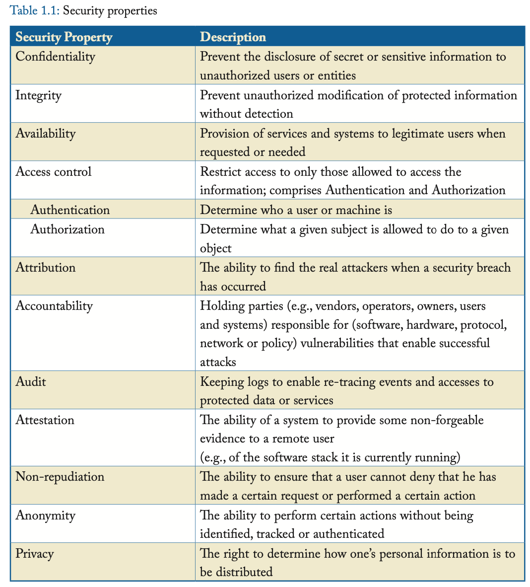
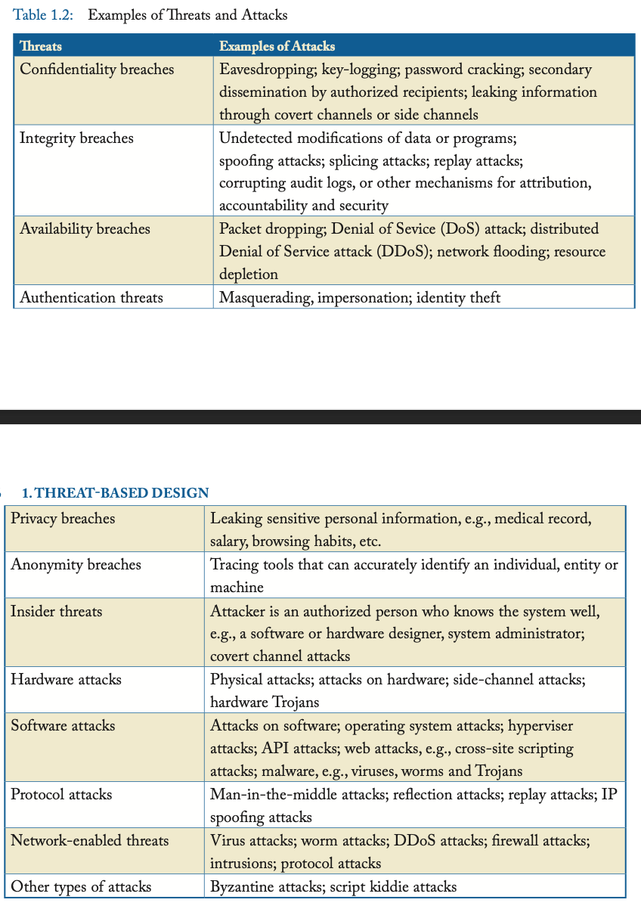
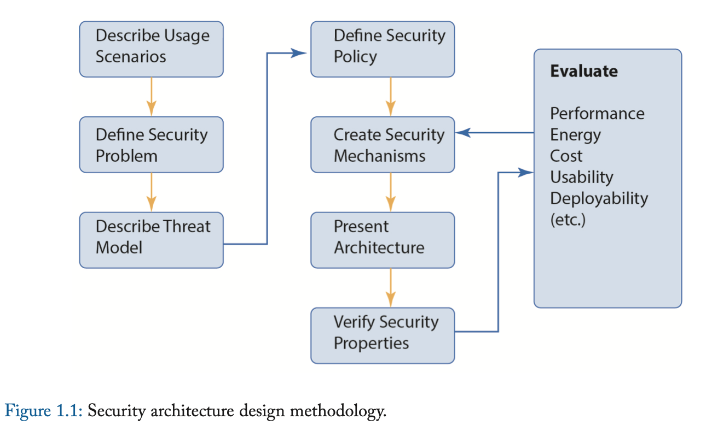

# Threat-Based Design 面向威胁的设计方法

计算机设计时考虑到功能、性能、成本、功耗、面积和可用性。
随着我们对于计算机的依赖日益提高，以及针对数字系统的网络攻击日益增多，设计提高安全的计算机系统变得至关重要。
面向安全的设计假定攻击者的存在，其将尝试利用计算机系统进行恶意行为。
我们称这种设计方式为**面向威胁的设计方法**。
这种安全性设计应该与性能、成本、能源效率、小型化和可用性设计同时进行。

那么什么是有风险的呢？
举几个例子，国家和国际安全、金融交易和经济竞争力以及个人安全和隐私都面临风险。
一般来说，对某人或某个实体有价值的资产都面临风险。这些资产的定义很广泛，可能包括信息技术 (IT) 基础设施、关键基础设施（例如电网）、知识产权、财务数据、服务可用性、生产力、敏感信息、个人信息和声誉。

我们称一种**威胁**是一类攻击，其违背了一种或多种安全特性。
我们称一个**攻击**是一个威胁的实例。
为了更好地理解威胁和攻击，我们需要首先定义安全中的一些概念。

## SECURITY PROPERTIES 安全特性

### CORNERSTONE SECURITY PROPERTIES 三大基石安全特性

计算机和通信系统需要或期望具有许多安全属性。
其中三种属性被称为基石安全特性：
* **机密性**(Confidentiality)
* **完整性**(Integrity)
* **可用性**(Availability)
我们将其缩写为CIA，这很容易记忆，因为它与美国中央情报局同名。

**机密性**是指防止秘密或敏感信息对未授权的用户或实体泄露。
**完整性**是指防止不能被察觉的未授权篡改。
**可用性**是指确保系统对于合法用户是随时可用的。
可用性同样也是提供一个可靠、可信且容错系统的目标，不过在安全的意义下，可用性必须考虑具有恶意意图的智能攻击者，而不仅仅是设备故障和故障。
后者的特征更容易建模，相反其行为通常很难用概率分布建模。

上述三者很难说谁更重要。
机密性对于秘密的、敏感的、私有的信息最重要。
对于机密性的违反在今天可能比以往更具破坏性，因为一旦机密信息呗公开在互联网上，就可以被所有人访问且永远无法删除。

尽管如此，对于你的银行余额来说，虽然机密性很重要，但完整性可能更重要——你并不希望你的银行账户被第三方恶意篡改。

可用性对于关键任务至关重要，诸如那些影响国家安全或者经济竞争的任务。
例如，当股票经纪人需要进行在线股票交易时，互联网和在线交易服务的可用性（或其反面，拒绝服务，DOS）可能导致利润或损失的巨大差异。

### ACCESS CONTROL 访问控制

保护敏感信息的机密性、完整性或可用性通常与限制只有那些被允许访问该信息的人才能访问有关，这也称为**访问控制**(access control)。
例如，你使用密码向计算机系统**认证**(authenticate)你的身份，以便访问其资源和存储在其中的文档。
登录到同一系统的系统管理员将被**授权**(authorized)执行比普通用户更多的功能。
因此，我们说**访问控制**确保只有被**授权**访问某些信息的**认证**用户才能访问该材料，同时拒绝未经授权的各方访问。[^1]

[^1]: 我们更喜欢将访问控制定义为由认证和授权两个部分组成，而一些安全专家则将访问控制和授权视为同义词。

认证回答的问题是“谁能去？”
我们考虑一个被认证了的人，John Bates。
授权回答了问题“John Bates被允许做什么？”
这两者在一起构成了对雨受保护对象的合法访问控制的重要组成部分。
AAA的缩写可以帮助我们记住这个重要的安全方法：访问控制，包括认证和授权(Access control, comprising Authentication and Authorization)。
认证和授权的概念可以适用于计算机、设备和程序，而不仅仅对人类。

表格1.1列出了基石安全特性以及其他几个我们想要的安全特性。
了解其他想要的安全属性有哪些是很重要的，尽管在本书剩下的部分中，我们仅关注基石安全特性（CIA）。

我们对安全属性和特性进行了非常广泛的定义，其中还包括隐私和匿名等属性，这些属性通常与安全性分开列出。
请注意，某些安全属性彼此矛盾。例如，匿名和身份验证可能相互矛盾。
请注意，匿名对攻击者来说也非常有利。

虽然“机密性”和“隐私”这两个术语在文献中有时可以互换使用，但我们强烈建议对它们进行如下区分：
机密性是保护秘密或敏感信息的义务，而隐私是决定如何分发或重新分发个人信息的权利。

### TRUSTWORTHY VERSUS TRUSTED 可信的与信任的

理想情况下，**安全计算机系统**至少提供机密性、完整性和可用性这三个基本安全属性。
然而，这通常既不可能也没有必要，在许多情况下，提供这些属性的不同子集（也有可能是超集）可能就足够了。
我们将在本章后面和整本书中进一步讨论这一点。

一个**可信计算机**(trustworthy computer)是指**被设计成**可靠的并提供安全特性，完成它被设计的工作并且不会产生对它或者别的系统的有害影响。
相反，过去人们提出的都是**信任的计算机**(trusted computer)，即人们依赖它去实现安全策略。
如果一个信任的计算机（或者信任的人）违背了信任，那么执行安全策略的所有努力都将失败。
信任的计算机未必可信，反之亦然。

例如，将军是受信任的，但是一个腐败的向敌方泄露军事机密的将军是不可信的。
因此，以来受信任的将军的安全策略可能会被突破。
相似地，一个计算机系统有时被我们盲目信任，用于保存某些机密信息，但是它可能从设计之初就不是可信的。
不幸的是，这种就是我们平时大量使用的商品计算机的常见情况。

对于计算机系统，术语**信任计算基**（trusted computing base, TCB）指一组硬件和软件组件，如果违反该组件，则意味着安全策略可能无法执行。
不幸的是，目前没有一种 COTS（Commodity Off-The-Shelf，现成商品）计算机系统能够实现可靠的可信计算基础。
事实上，COTS 计算机的设计并不值得信赖。
安全性通常是事后才添加的，这会导致性能、成本、上市时间和易用性下降。

为了未来的 COTS 计算机可以变得可信，我们需要计算机架构师理解安全问题。
今天，安全问题在美国高校的软硬件课程中都不被涉及。
去弥补这个事实是十分重要的，即使得计算机架构师、系统设计者和学生理解、研究、设计、发展可信计算机系统。

因为确保巨大且复杂的软硬件系统饭圈不受bugs和安全漏洞威胁是困难甚至不可能的，我们需要使得信任计算基(TCB)尽可能小，以最大化它正确且不受安全漏洞威胁的可能性。
所谓对于一个实体（如TCB）的**攻击界面**(attack surface)是指攻击者可以经由而渗透进实体的部分；具体渗透的手段和方法我们称之为**攻击矢量**(attack vector)。
更小的TCB意味着攻击者可以用于渗透进入系统、破坏其完整性或偷窃其秘密的攻击界面和攻击矢量更小。
此外，较小的信任软件组件比大型、复杂的软件组件更适合形式化验证技术。

## THREATS AND ATTACKS 威胁和攻击

所谓**安全缺口**(security breach)是指一个违背安全特性的事件。
(A *security breach* is an event that violates a security property.)
例如，它可以是机密性、完整性或可用性的缺口。
一个安全缺口可能是故意引起的，也可能是无意的。

**威胁**(threat)是指任何可以破坏有价值资产或引起安全缺口的行为。
例如，存在泄露威胁、修改威胁和拒绝服务威胁，它们分别威胁到保护机密性、完整性和可用性的主要安全目标。

**攻击**(attack)是指威胁的特定实例。
它包括了对于系统、利用的漏洞、攻击的方式和被攻击的资产的细节描述。

**漏洞**(vulnerability)是指系统中的一个弱点，它可以被利用去造成对有价值资产的破坏。
在一个攻击中，攻击者可能利用一个或多个漏洞。

表格1.2列出了一些威胁和典型的攻击。
其中一些攻击从名称上就一目了然，而其他攻击将在后面的章节中详细描述。
列表和示例旨在说明性，而不是全面性。
大多数攻击最终都会导致机密性、完整性或可用性的破坏。
虽然我们不会在这里描述每种攻击，但感兴趣的用户可以通过 Google 搜索轻松找到它们的描述。
这里的目标只是说明广泛的已发现的攻击。

为了成功地防御攻击，我们需要了解攻击者的动机及其思考方式。
”了解你的敌人“是重要的防御策略以及“面向威胁的设计方法”的基础。

“黑帽黑客”是指为了恶意目的而实施攻击的人，而“白帽黑客”是指像攻击者一样思考、提议甚至执行部分攻击以提醒组织加强防御的人。

**网络攻击者**(cyber attackers)已从为乐趣和名声而发动攻击的黑客，演变为利用网络攻击进行勒索或诈骗的犯罪实体，再演变为财力雄厚、技能精湛的高端网络攻击者。
这些攻击者可能是试图摧毁电网等关键基础设施的网络恐怖组织，也可能是有能力发动网络战的国家攻击者。
因此，风险和收益更高，攻击者也更强大。
此外，攻击已经自动化，因此攻击者不必是专家程序员，也不必非常了解系统即可发起成功的攻击。
其中一些自动化攻击有时被称为**脚本小子攻击**(script kiddie attacks)。

## COUNTERMEASURES AND DEFENSES 对策和防御

**对策**(countermeasure)是对攻击的防御。
该术语体现出在过去安全措施的被动立场：攻击发生后，我们提出对策（理想情况下可以实施）。
更主动的立场正在不断被重视。
“威胁与防御”和“攻击与对策”这两个术语经常一起使用。

防御攻击可分为检测、预防、缓解、恢复和取证防御。
人们可以尝试检测系统中的漏洞并尝试消除这些漏洞。
人们可以尝试预防攻击发生。
攻击开始后，人们可以尝试缓解攻击的影响。
成功攻击后，人们可以尝试尽快、尽可能彻底地从攻击中恢复，并且通常对攻击做出响应。
最后，设计机制来收集取证证据并正确归因攻击是很有用的。

## THREAT MODEL 威胁模型

不同的应用场景需要不同种类和层级的安全性。
针对不同层级的威胁，有许多不一样的资产需要被保护。
例如，防止不被允许的视频下载显然和对核武器机密的保护是不一样的。
破坏造成的风险越大、资产的价值越高，我们就需要更高程度的安全保护。
由于涉及一个适用于所有场景的安全计算机是不可能也不必要的，阐明设计和评价一个计算机系统时候的威胁模型是很重要的。

**威胁模型**(threat model)阐明了哪些种类的的威胁系统会防御，而哪些不在考量范围。
例如，在特定的应用场景中，防止机密性缺口是最重要的，而可用性就不太被考虑。
这意味着哪怕一个拒绝服务攻击发生了，攻击者也无法得到任何敏感信息。
例如，机密信息可以被攻击者无法获取的密钥加密，或者密钥会在攻击发生后立即被销毁。
这被称为机密性保护的**故障安全**(fail-safe)策略。

威胁模型还会指定是否只考虑对运行系统的攻击，或者系统是否还考虑在系统开发过程中的攻击，例如由系统程序员或硬件设计师进行的攻击。
这些分别称为**运行攻击**(operational attacks)和**开发攻击**(development attacks)。
开发攻击是一类**内部攻击**(insider attacks)，通常更难防范，因为设计者（内部人员）实际上是在系统中构建后门或信息泄露机制。
系统的实现将根据设计[^2]进行验证，从而验证其正确性，因为后门漏洞是设计的一部分。

[^2]: 例如，硬件芯片设计成为验证芯片不同制造级别的黄金网表。(For example, a hardware chip design becomes the golden netlist for verifying different levels of fabrication of the chip.)

威胁同样也有**主动**(active)和**被动**(passive)的区别。
例如，监听(eavesdropping)公用互联网或无线网是一种被动的攻击，而修改该网络上被发送的信息是一种主动的攻击。

威胁模型可以只关心软件攻击，或者也关心硬件攻击。
强大的系统软件，诸如控制了系统资源的操作系统和虚拟机监视器，同样可以是违背协议的（被攻击或本身腐败）。
因此威胁模型同样可以包括恶意的或者违背协议的操作系统或虚拟机监视器。

有些攻击是已知的，并且已经发展起了用于检测这种攻击的**攻击签名**(attack signatures)。
攻击签名是一个或一类攻击的特征。
例如，病毒扫描程序利用已知的病毒签名的数据库来检测计算机中的病毒。
还有一些攻击是以前从未见过的，被称为**零日攻击**(zero-day attacks)。
威胁模型可以指定零日攻击是否是目标或不被考虑。

威胁模型应该清楚地阐明对于系统的假设，系统的用户以及攻击者的能力。
威胁模型应该阐明哪些种类的威胁被考虑，哪些不被考虑。
威胁模型不需要描述其防御的攻击的细节。

## SECURITY ARCHITECTURE DESIGN METHODOLOGY 安全架构设计方法

图1.1展示了我们推荐的设计安全计算机系统的方法，尤其是那些涉及到新的硬件安全方法或特性的系统。
它展示了我们如何将面向威胁的设计方法融入计算机设计流程。

首先，描述你正在设计的使用场景。
然后，应该清楚简洁地定义安全问题（最好只用一句话）。
接下来，应该定义威胁模型，以阐明解决方案将解决哪些威胁，以及未考虑的威胁及其原因。
通常，在特定的使用模型中，某些威胁不太可能发生或优先级比其他威胁低得多。
然后，应该定义适合使用场景的安全策略（或一系列策略），并在正确执行适当的策略时防御威胁模型中的威胁。
（我们将在后面的章节中讨论安全策略。）

解决方案可能涉及增强现有架构或创建新架构以执行所需的安全策略，从而防御威胁模型中考虑的威胁。
安全社区将这些称为**安全机制**(security mechanisms)。
在架构社区中，我们称它们为安全架构功能。

安全策略规定了保护所需安全特性、提供所需安全特性和防御攻击的规则，而安全机制则旨在执行这些安全策略。
如果定义了错误的安全策略，那么再多的安全机制也无法防止安全漏洞。
同样，即使定义了最全面、最正确的安全策略，如果没有可以执行该策略的安全机制，那么这也没有用。
安全机制可以在计算机或分布式计算机系统中的任何软件、硬件或网络层中实现。

理想情况下，这些安全机制最好是计算机初始设计的一部分。
通常，它们也可以集成到现有设计中。然后获得整个架构。
除了安全目标之外，还必须确保性能、功耗、面积、成本和可用性目标也得到满足。
否则，用户将选择性能更高、更节能（节省电池）或成本更低的计算机，而不是更安全的计算机。
因此，在设计可信计算机时，我建议**安全架构**(security-aware architecture)的目标（我的学生有时称之为 Lee's mantra）是：
    **“实现安全性，而不违反性能，**
    **功耗，成本和可用性。”**
    *(Security without compromising performance,*
    *power consumption, cost and usability.)*

虽然除了特定情况外，这通常是无法实现的，但我们希望富有创造力的计算机架构社区提出非常巧妙的解决方案来满足这一目标。

新架构提供的安全特性应该在设计时被仔细地验证。
这是设计验证的一个新方面，需要为此开发新的工具和方法。
为安全验证而开发的形式化验证技术目前无法扩展到复杂的软硬件系统。
事实上，大多数工具适用于纯软件设计或纯硬件设计，但不适用于软硬件架构。

设计还必须评估其性能、功耗、面积、成本、可用性和可部署性。
如果新的安全机制严重降低了高性能、低功耗等市场要求，则应迭代设计（如图 2.1 所示）。
许多安全系统之所以没有成功，是因为它们牺牲了性能、长电池寿命和易用性等市场驱动因素。

新的安全计算机架构如何影响现有软件程序和软硬件生态系统的使用，也将影响其部署和使用的简易性。

我们将**安全验证**(security varification)设定为在设计时完成，而安全评估通常在成品或系统上完成。
好的的安全规定要求，安全验证或评估不应由设计团队完成。
为了让富有创造力的人类攻击者对系统施加压力，通常使用一种称为“红队、黑队”(red team, black team)测试的策略。
这让一组攻击者与一组系统防御者对立起来。