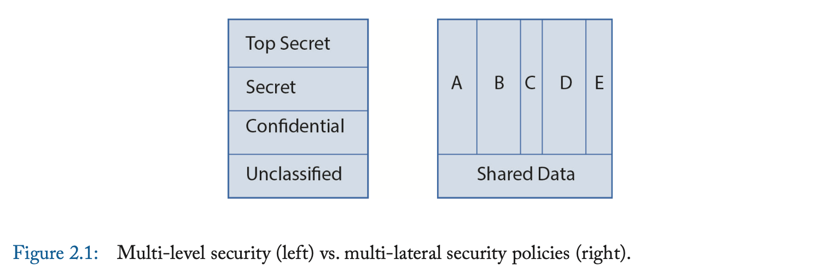
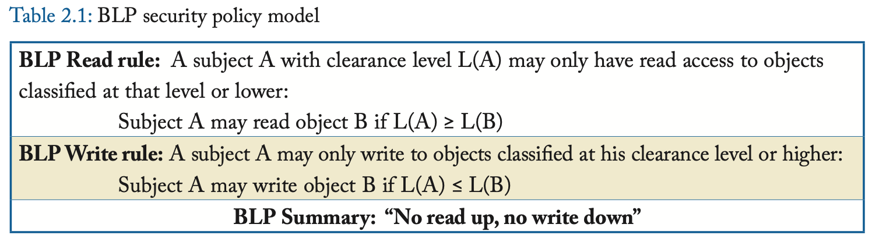

# Security Policy Models 安全策略模型

现实生活中的安全策略可能会非常复杂。
它们通常由代表各利益相关者利益的委员会和/或公司高管制定。
安全策略不是由工程师决定的技术问题。
相反，工程师设计了执行安全策略的安全机制。

安全策略模型让我们能够理解安全策略。
它们提供了一种抽象，使得我们可以关注到保护模型中的核心思想，同时避免陷入特定安全策略中遇到的复杂问题。

在本章中，我们讨论多级安全（MLS）策略模型(muti-level security policy model)（2.1节），以及多边安全策略模型(multi-lateral security policy model)（2.2节）。
图2.1展示了这两种模型。
引用文献[6,7,8,9]中可以找到对于安全策略的好的讨论。

## MULTI-LEVEL SECURITY POLICIES 多级安全策略

多级安全（MLS）策略假定了一种层次化的访问模型，其中主体和客体被划分为不同的安全或完整性级别。
存在严格的规则描述允许的信息流方向，基于这些先验的分类。

图2.1左半部分展示了防御系统对客体化分了几种不同的安全等级：
顶级秘密（TS），秘密（S），机密（C），公开（U）。
(Top Secret, Secret, Confidential and Unclassified.)
相似的，主体的访问许可也被划分为四个等级：TS，S，C，U。
公开等级是不受限制的，且更高的访问许可需要更广泛的背景检查。
这四种安全等级有如下的偏序关系：
$$
\text{TS}\ge\text{S}\ge\text{C}\ge\text{U}
$$

某个拥有TS等级访问许可的人可以访问所有等级的客体，而拥有S等级访问许可的人只能访问S等级及以下的客体。
虽然最初是为了军事目的设计的，MLS策略现在也被用于商业系统中，例如领导层（TS）相较于经理（S）可以访问公司所有的更多信息，而经理（S）可以比员工（C）访问更多信息，员工（C）可以比公众（U）访问更多信息。

机密性和完整性有单独的规则。
我们在下面讨论这些规则，即用于保护机密性的 Bell La Padula (BLP) 安全策略模型和用于保护完整性的 Biba 模型。

### BELL LA PADULA (BLP) FOR CONFIDENTIALITY 针对保密性的 Bell La Padula (BLP) 模型

BLP是一种MLS策略模型，用于保护机密性。
机密性首先且主要关注通过**读**的方式访问客体。
其后，**写**操作也需要被管控，由于高读权限主体的写操作可能向不具有高读权限的主体泄露信息。
BLP（根据作者名字命名）有两条规则，如表格2.1所示。
$L(x)$表示客体$x$的安全等级或主体$x$的访问许可等级。

针对**读**的规则，也被称为“简单安全属性”(Simple Security property)，很好理解。
它要求主体只能读取比自己访问许可等级低的客体。

针对**写**的规则，也称为 \*-属性（发音为“星”属性），更难理解。
(The write rule, also called the *\*-property* (pronounced "star" property), is harder to understand.)
我将通过一个例子来解释这一点。
假设一位拥有最高机密（TS）权限的腐败将军，他正在与一名被怀疑是俄罗斯间谍的人进行通信，而该间谍的权限为非机密（U）。
由于将军可以阅读最高机密文件，如果允许他写入非机密文件，间谍就可以阅读非机密文件，其中可能包含将军已阅读的一些最高机密信息。
\*-属性可防止此类信息泄露。
（这也是一个信任的主体不可信的例子。）

当两个或多个不同安全等级的客体组合在一起时，BLP具有“高水位标记”(high-water mark)效果：
组合后的客体的安全等级取所有组合前客体的安全等级的最高值。

举个最近的例子，考虑维基解密案。
如果实施了严格的BLP安全策略，那么士兵将无法访问TS文件（除非他有TS访问许可）。
但是如果他有TS许可，\*-规则将阻止他将信息写入非机密文档、存储或网络，这样他就无法将TS信息泄露给维基解密。
当然，真实的故事要复杂得多。