# Early Load Execution via Constant Address and Stride Prediction

## Abstract

一种有效减少加载操作延迟的系统和方法。
在各种实施例中，处理器的逻辑在获取指令之后访问预测表。
对于预测表命中，逻辑使用从预测表中检索到的预测地址执行加载指令。
对于预测表未命中，当逻辑确定加载指令的地址并命中学习表时，且当学习表中存储的地址与确定的地址匹配时，逻辑更新置信度指示以指示更高的置信度。
当逻辑确定存储在学习表的给定表条目中的置信度指示达到阈值时，逻辑在预测表中分配存储在给定条目中的信息。
因此，在下一次查找预测表时，预测地址可用。

Patent 实在是不好读。
十分啰嗦。

## Processor Core

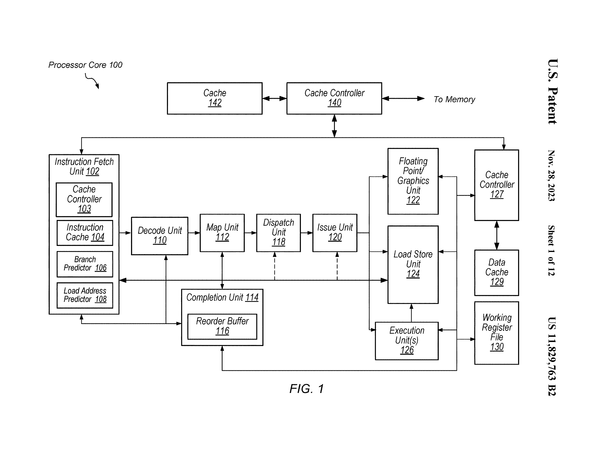

注意这里利用了 PC history akey 去做查找。且查找可能在 decoder 前/同时/后。

Map Unit 用于给译码结果或者 uop 分配物理寄存器。

STL 会被认为 mispredict 这是用于防止从 cache 读造成的 RAW 错误。

## Early Load Method

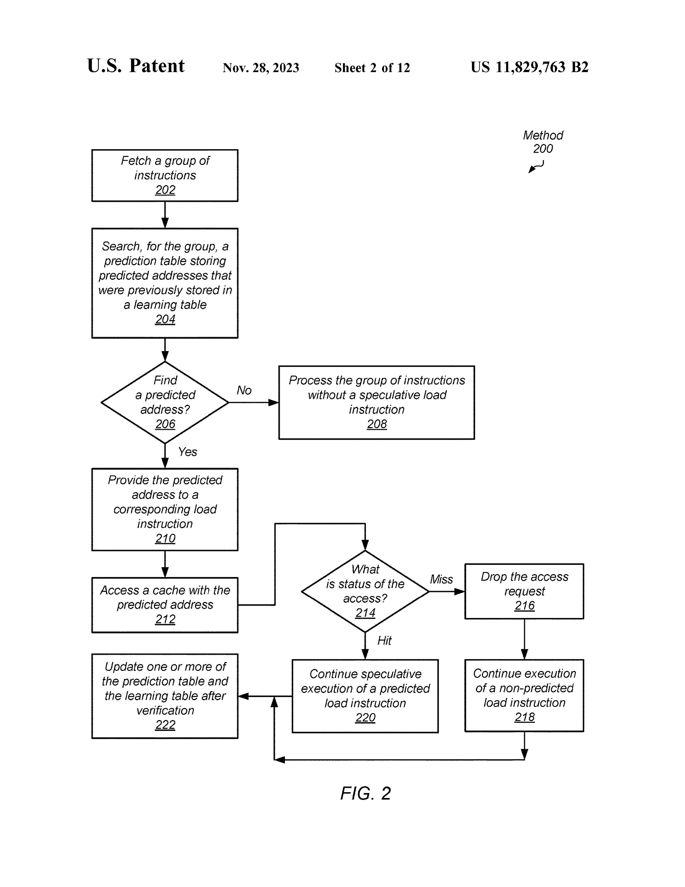

intsr. 会被拆分为两条指令 pred. instr. 和 non-pred. instr.。

注意到这里强调 predicted load 需要在 cache 中。
这很合理，因为如果不在，predicted 和 non-predicted load 之间的延迟差别不大。

但是文中也说也可能会进一步向更低的 cache 查找。

## Load Addr. Predicting Method

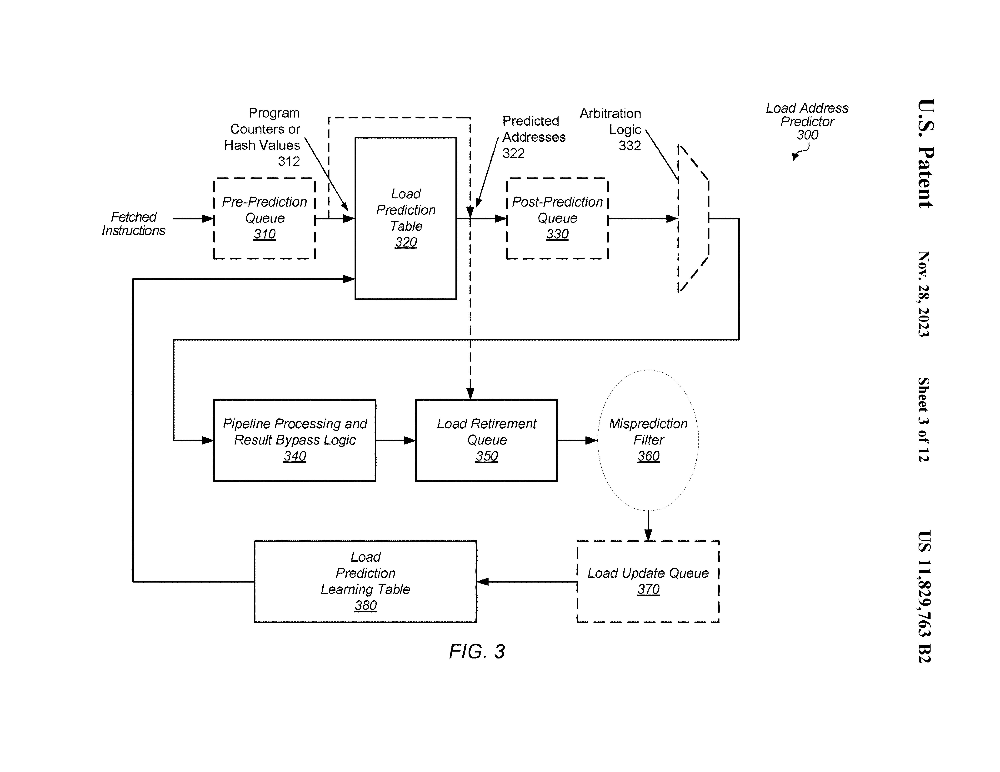

注意到这里强调了一个 arbitration logic，这意味着进程信息等许多因素决定了 load 是否会被预测。
因素的权重被一个 programable reg. 保存。

在这个方法中，被执行的 pred. load 和 cache miss 的 pred. load 会被放到 retire queue。
基于 PA 对 retire queue 中的 load 进行检查，更新 learning table。

不是所有的 retire queue 中的 instr. 都会被学习。
例如总是预测错误的可能会被记录到 filter，后续不再学习之。

## Table Entry

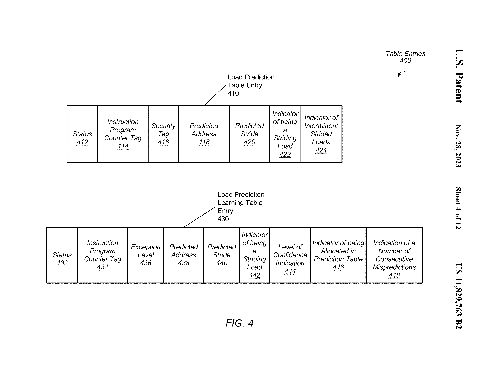

Securty tag 可能包括ASID、VMID。

这里的 intermittent strided load 很有意思。
由于提高 LT 中置信度导致在 PT 中分配 entry 的 load 和下一个周期被预测的 load 中有多个指令正在流水级，故可能会导致 stride 预测错误。
这里采用两种方式解决：
1. 认为第一个在 PT 中查找到的是 probing instr.，阻塞后面的查询，直到 probing tnstr. 被处理结束，确定 intermittent 的数量。
2. 跟踪记录流水级中 instr. 的 PC，直接确定 intermittent 的数量。

## PT Miss Handling Method

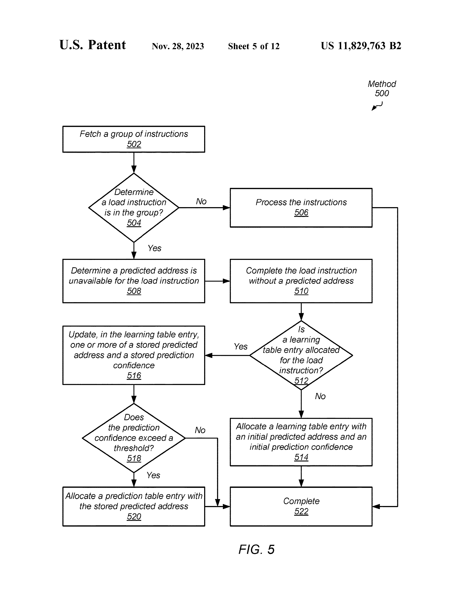

会在 accessing LT 之前首先做 STLF。
这里提到 STLF 也会有 prediction。

## LT Entry Updating Method

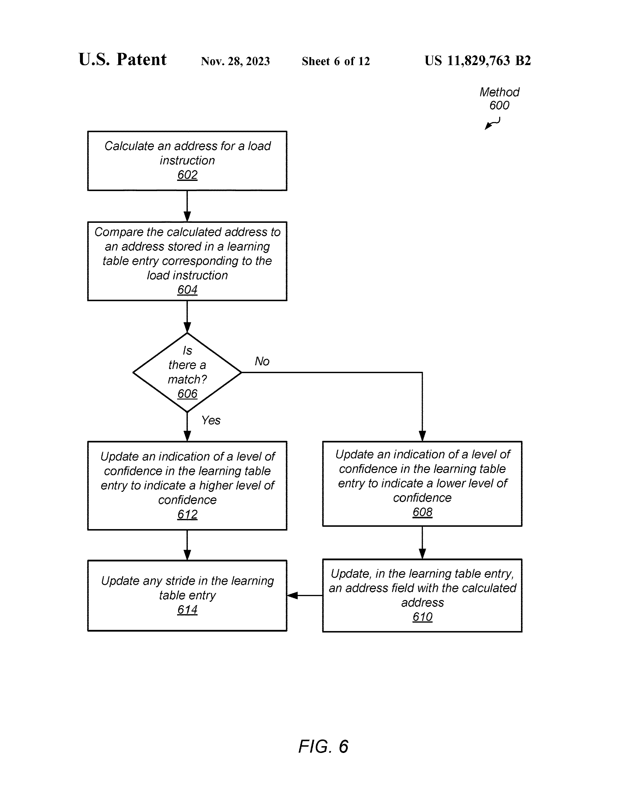

注意到这里有种实现是更新 base addr. 为原本的 base addr. + stride。

## PT Entry Updating (Based on LT Entry Updating) Method

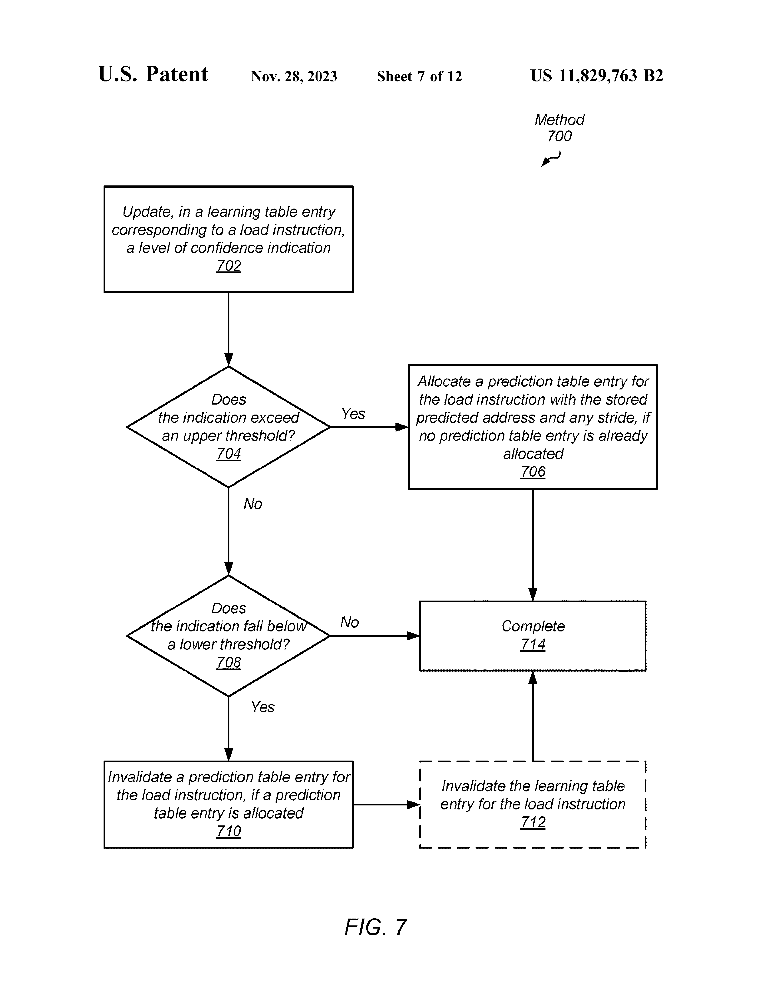

LT entry 中的置信度会决定是否添加/清除 PT entry。

PT enrty 清除的阈值可能会比 LT entry 清除的阈值高。
也有可能 LT entry 不主动清除，只会被 evict。

## LT&PT Resource Saving Method

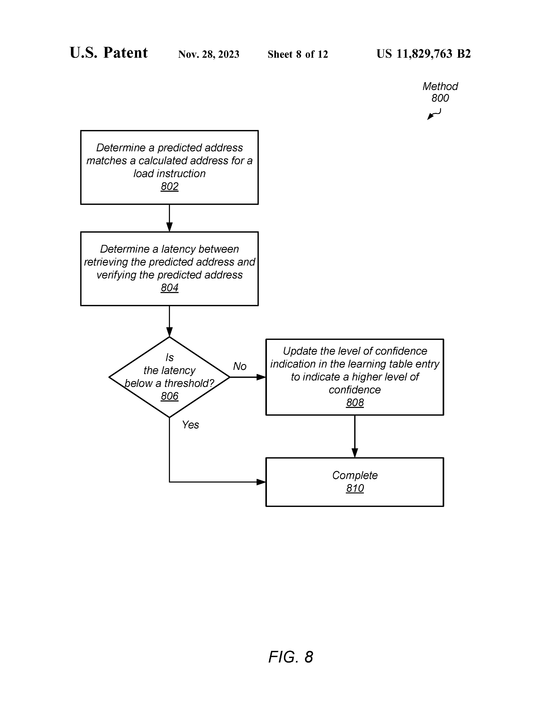

这里很有趣，如果衡量到某条 pred. instr. 和其 non-pred. instr. 的延迟差别不大，那么就在后续不再预测该条 instr.。

文中给出了延迟不同的定义。

**具体什么因素会影响单个 pred. instr. 和 non-pred. instr. 的延迟差别，文中没有给出。**

## LT Entry Invalidating Method Using Consecutive Mismatch Count

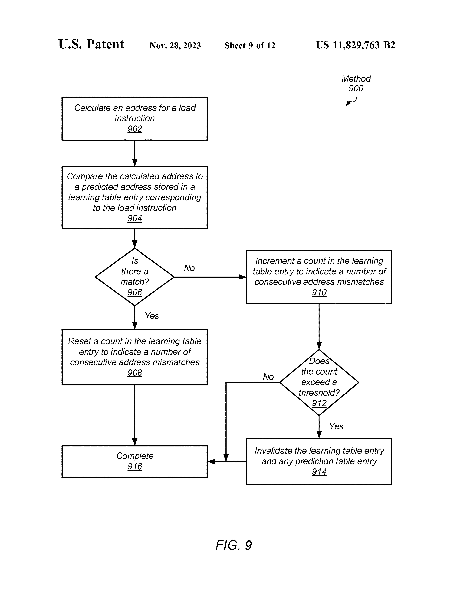

这是一种方法，不同于上述的基于置信度的 LT entry 清除方法。

## Avoiding Discrepancies in Memory Access Ordering

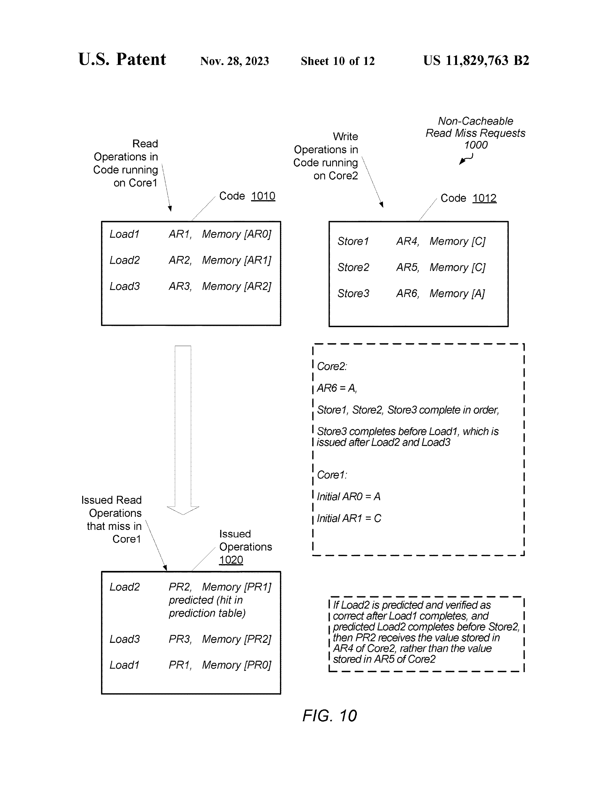

图例疑似有错，AR6 应该是 A。

这里假定：
- store instr. 在所有 non-pred. load instr. 之前均完成。
- pred. load 在 store1 和 store2 之间执行。
- 对于 load2 的预测是正确的。

倘若不进行预测，这里的 load2 会在 load1 之后执行，PR2 的值是 AR5 的值。
但是进行预测后，PR2 的值是 AR4 的值。这造成逻辑上应该先执行的指令 load1 看到的内存状态比 逻辑上应该后执行的指令 load2 看到的内存状态要在时序上靠后。且由于预测地址没有错误，Core1 无法发现该错误。

为了避免这种访存顺序不一致，不允许存在操作数依赖于先前的 load instr. 的 load instr. 被预测。

**实际上我并不是很理解这一部分。不存在操作数依赖的 load instr. 如果被提前执行了，似乎看到的内存时序和逻辑上的执行时序也是不一致的。如果 AR6 就是 A，那么检查 load2 是否预测正确的时候应该就是不正确，和文中描述也不符合。**

## Soc & System

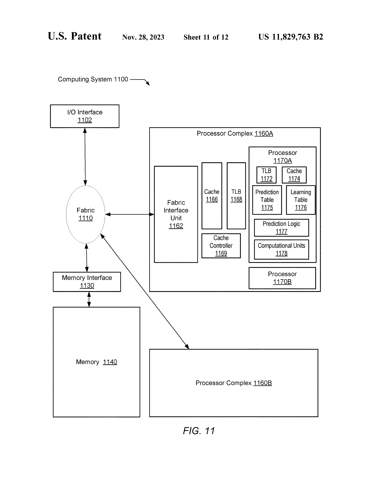

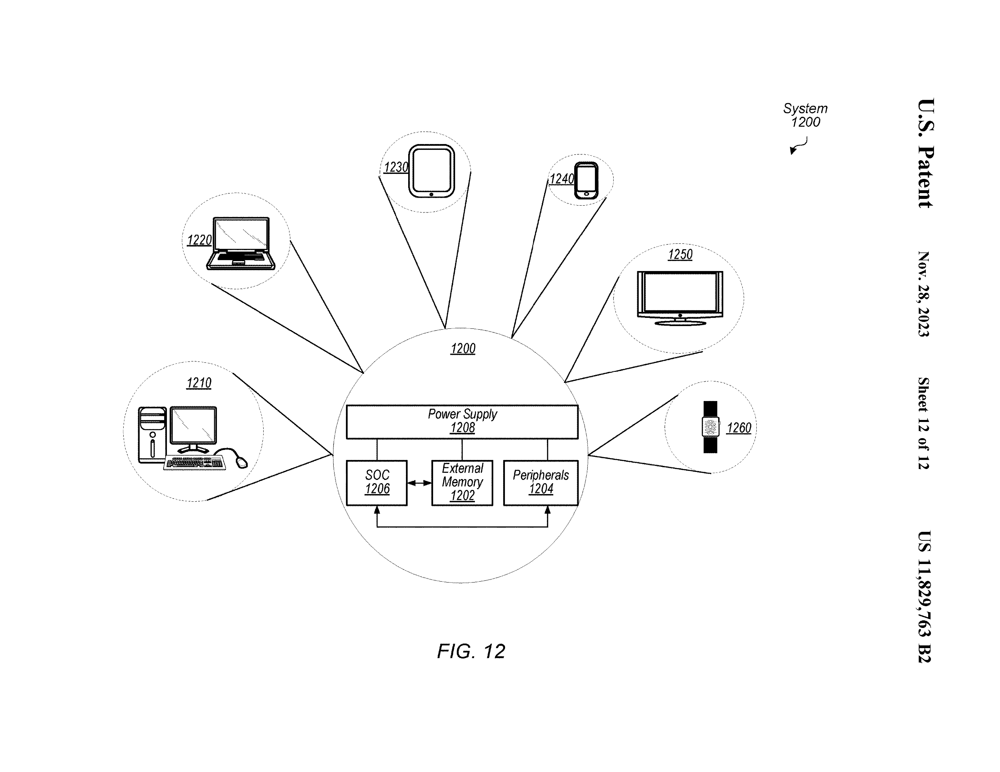