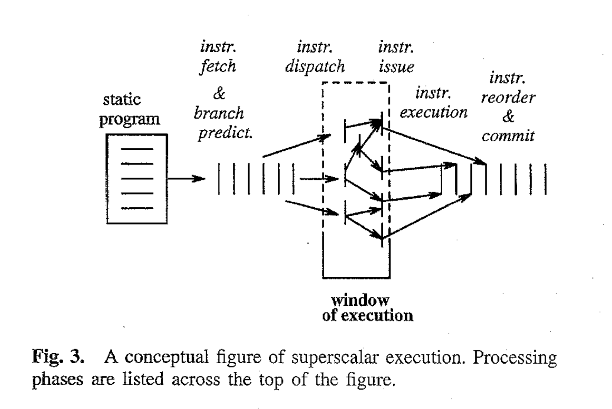
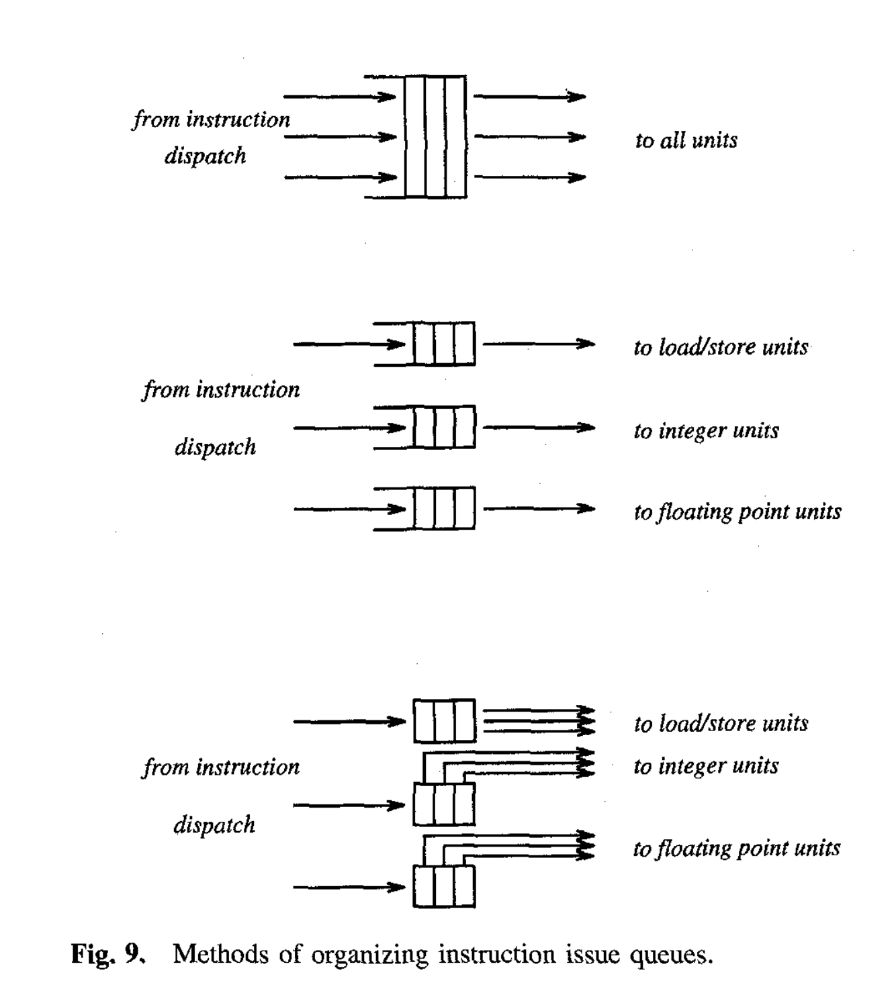

# The Microarchitecture of Superscalar Processors

## 背景

《现代计算机体系结构》课程作业要求阅读1995年 J. Smith 和 G. Sohi 的论文 [The Microarchitecture of Superscalar Processors](https://ieeexplore.ieee.org/document/476078) 。本文是对这篇论文的学习和整理的笔记。

<!-- more -->

## Abstract

文章主要从4个方面讨论：

1. 取指和条件分支处理
1. 涉及寄存器值的数据依赖的确定
1. 针对并行执行的指令初始化与发射
1. 顺序提交指令状态以支持精确中断

举例用了 MIPS R10000，DEC 21164，AMD K5。

## Introduction

95年附近 SS 处理器已经广泛应用在各厂商高端处理器，覆盖 DEC Alpha，RSIC，x86 等指令集。

典型 SS 处理器：

> A typical superscalar processor fetches and decodes the incoming instruction stream several instructions at a time. As part of the instruction fetching process, the outcomes of conditional branch instructions are usually predicted in advance to ensure an uninterrupted stream of instructions. The incoming instruction stream is then analyzed for data dependences, and instructions are distributed to functional units, often according to instruction type. Next, instructions are initiated for execution in parallel, based primarily on the availability of operand data, rather than their original program sequence. This important feature, present in many superscalar implementations, is referred to as *dynamic instruction scheduling*. Upon completion, instruction re- sults are resequenced so that they can be used to update the process state in the correct (original) program order in the event that an interrupt condition occurs. Because individual instructions are the entities being executed in parallel, superscalar processors exploit what is referred to as *instruction level parallelism* (ILP).

1. 并行取指（分支预测）
2. 分析数据依赖，分配FU
3. 基于操作数可获取性乱序启动指令执行（i.e. 动态指令调度）
4. 指令结果重排序，以便精确中断

指令执行模型由于历史原因被认为是顺序执行的，因此精确中断一直被使用。

SS 处理器包括以下技术：

1. 并行多指令取指，通常利用分支预测
1. 真依赖的检测及数据转发
1. 同时发射多指令的技术
1. 硬件资源以供同时执行（多个 FU，内存支持多地址访问）
1. Methods for communicating data values through memory via load and store instructions, and memory interfaces that allow for the dynamic and often unpredictable performance behavior of memory hierarchies. These interfaces must be well matched with the instruction execution strategies.
1. 顺序提交以维护顺序执行模型

## 程序表示，依赖，并行执行

数据依赖在读写同一个存储位置（寄存器或者内存）时出现。理想情况下，指令执行仅服从真依赖（RAW，*read-after-write*）。

然而其他因素造成的假依赖也存在。假依赖由 WAR (*write-after-read*) 和 WAW (*write-after-write*) 导致。

> Artificial dependences can be caused in a number of ways, for example: by unoptimized code, by limited register storage, by the desire to economize on main memory storage, and by loops where an instruction can cause a hazard with itself.

因此，硬件调度可能要求乱序执行、推测执行、存储不可以立刻更新，数据转发。状态更新（通常称为指令的提交 *committing* 或者过时 *retiring*）不在执行后而在确定顺序执行模型会执行该指令后。

## 典型 SS 处理器的微体系结构

典型结构：

1. 取指与分支预测
1. 译码与寄存器依赖分析
1. 发射与执行
1. 内存操作分析与执行
1. 指令重排序与提交

注意这种分段可能未必能和流水线阶段对应。這些工作會給別人做去了！放一段原文：

> Keep in mind that underlying this organization there is a pipelined implementation where specific pipeline stages may or may not be aligned with the major phases of superscalar execution. The underlying pipeline stages are to some extent a lower-level logic design issue, depending on how much work is done in each pipeline stage. This will affect the clock period and causes some very important design tradeoffs regarding the degree of pipelining and the width of parallel instruction issue. However, we will not discuss these issues in detail here; discussions of these types of tradeoffs can be found in [[13]](https://www.sciencedirect.com/science/article/abs/pii/074373159090064V), [[34]](https://dl.acm.org/doi/pdf/10.1145/68182.68207), [[38]](https://dl.acm.org/doi/pdf/10.1145/17356.17403).

### 取指

需要缓存支持一周期多地址读，并且数量应该不小于译码和执行的单周期峰值。使用 buffer 来减少由于 cache miss 或者分支造成的阻塞。

对于分支指令的处理很重要。分析分支指令判断的一般流程：

1. 鉴别分支指令
1. 计算是否分支
1. 计算分支地址
1. 重定位取指

通常采用如下的技术处理：

1. 鉴别分支指令：cache 中通过 pre-decode 的手段存储额外的信息。很难通过 opcode 的选择实现，由于兼容性和码字长度等限制。
1. 计算是否分支：通常用于判断的数据尚存在依赖关系，因此采用预测。
1. 计算分支地址：采用缓存。
1. 重定位取值：不管是分支发生还是预测分支发生，都会造成至少一周期的延时。有些 buffer 会同时取两种情况的指令。

### 译码，重命名寄存器，指令分配

译码阶段为每个指令生成一个执行元组 execution *tuple*。

> An execution tuple is an ordered list containing: 1) an operation to be executed, 2) the identities of storage elements where the input operands reside (or will eventually reside), and 3) locations where the instruction’s result must be placed.

类似于 RUU，不过这篇文章中叫 reorder buffer。

### 指令发射与并行执行

第三种情况，保留站，实际上就是课上学的 RUU 的一部分

### 处理内存操作

> Rather than have rename tables with information for each memory location, as we did in the case of registers, the general approach is to keep information only for a *currently active* subset of the memory locations, i.e., memory locations with currently pending memory operations, and search this subset associatively when memory needs to be accessed.

### 提交

### 软件协同

> Though a major selling point of superscalar processors is to speed up the execution of existing program binaries, their performance can be enhanced if new, optimized binaries can be created. (The new binary could use the same instruction set and the same sequential execution model as the old binary; the only difference might be the order in which the instructions are arranged.)

汇编指令的优化排序可以使得取指更有效率。

1. 使得一组指令可以被同时发射
1. 减少存在真数据依赖的可能性

## 三个例子

- MIPS R10000: Typical framework described above.
- DEC Alpha 21164: Striving for greter simplicity.
- AMD K5: Implementing a more complex and older instruction set, the Intel x86.

### MIPS R10000

同时取四条指令。指令在进入 icache 时会 predecode 产生 4 bit 信息。具体参数略。有趣的是会同时在 resume cache 中保存分支预测产生跳转时的原本顺序指令。

采用物理寄存器的方式，其容量时逻辑寄存器的两倍。

三个 instruction queues。乱序执行（并不按照 queue 中的顺序）。

后略。

## Conclusion

> After being fetched, the sequential instruction stream is torn apart with only true dependences holding the instructions together.

随着硬件资源的增加，超标量处理器的效益递减：

1. 即使采用非常激进的手段，目前的超标量处理器在指令并行层面仍有极限。这种极限主要是条件分支。真实分支预测相较于完美分支预测试得到的性能有较大下降。
1. 并行指令数的增加导致硬件实现的复杂度激增，也导致控制逻辑（交叉检查）平方增加，影响主频。

此外，处理器性能和内存性能的差距在增加。包括更好的数据 cache 设计，更好的 prefetch 手段，更复杂的存储层次，数据提供能力更优的内存等手段也在被探索。这也是制约指令层次并行进一步提升的因素。

8路超标量被认为是实际的极限。下一步是什么？有的学派认为会是 VLIW，他们有两个支持原因：

1. 软件分析产生的并行窗口会比硬件分析更大。
1. 硬件不必做任何依赖检查，VLIW 硬件更好实施，也可以有更高的主频

反对者认为超标量的控制逻辑产生的实际性能影响并不很大；且编译时调度未必有利用运行时信息做出的动态调度好。

另一种学派认为可以不必遵守顺序执行模型（多处理器）。