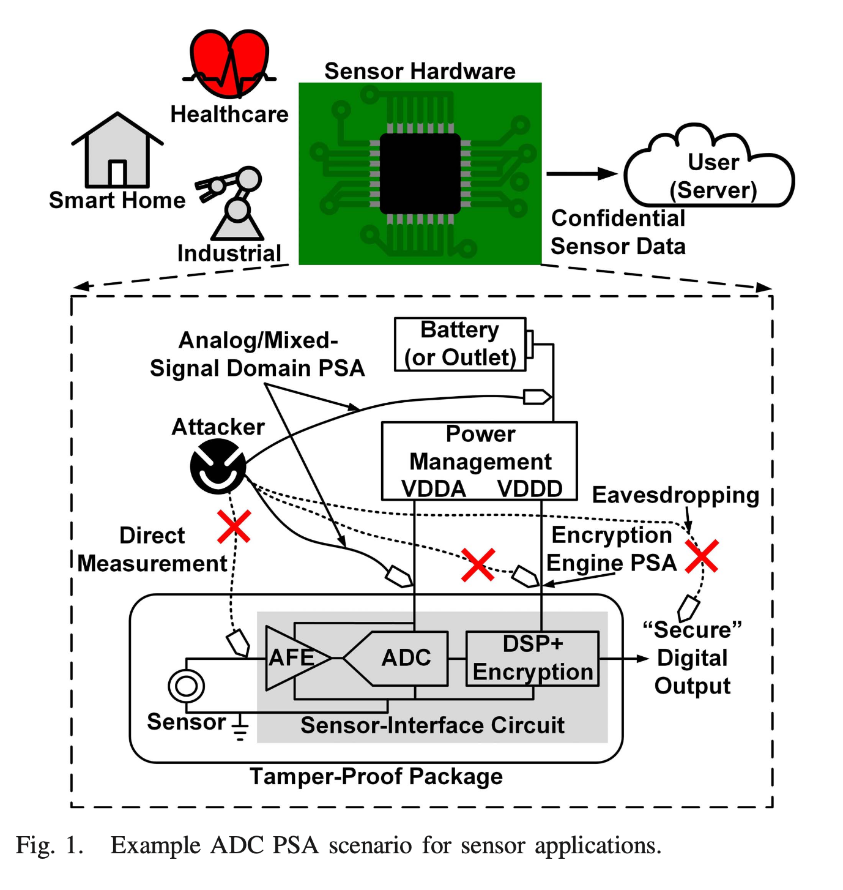
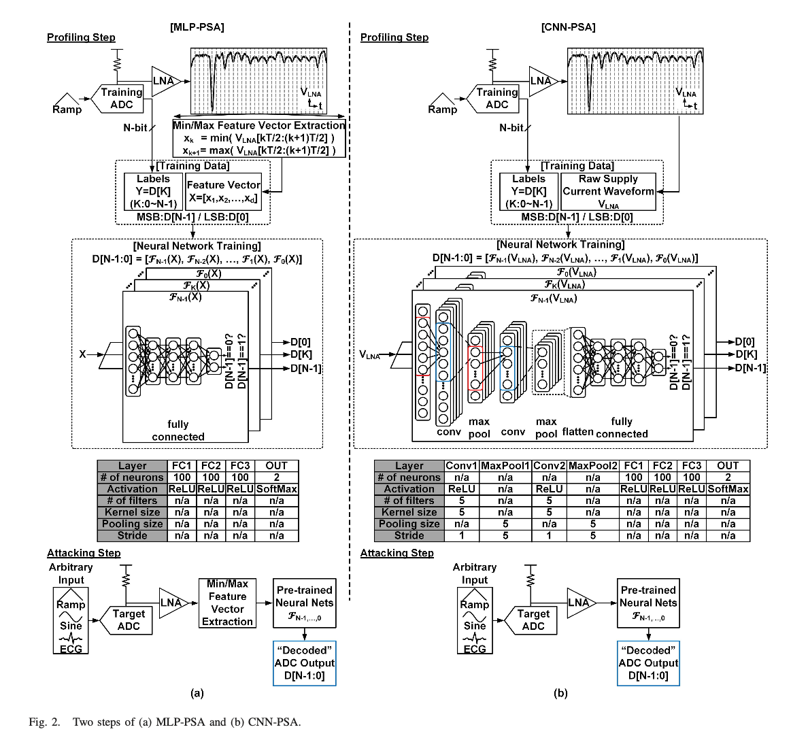
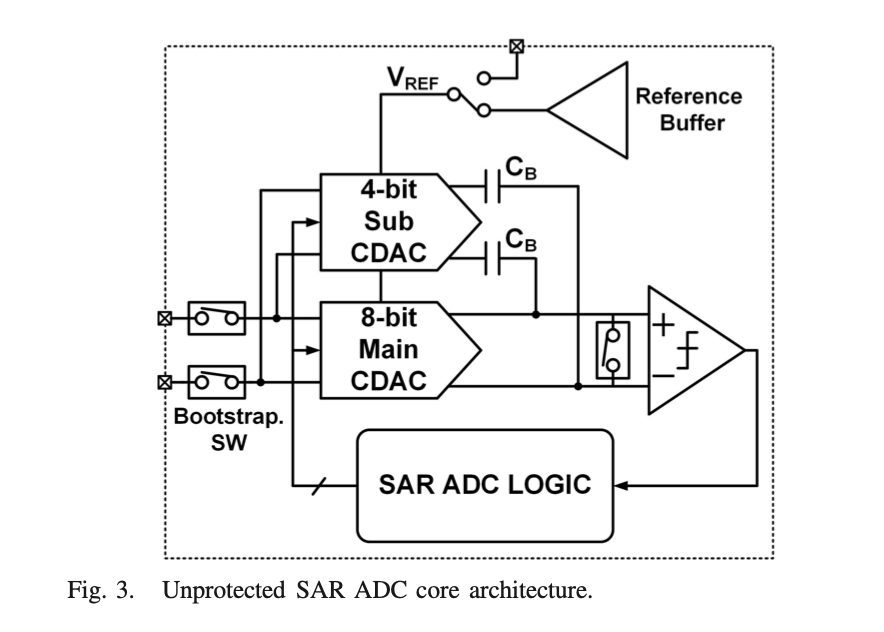
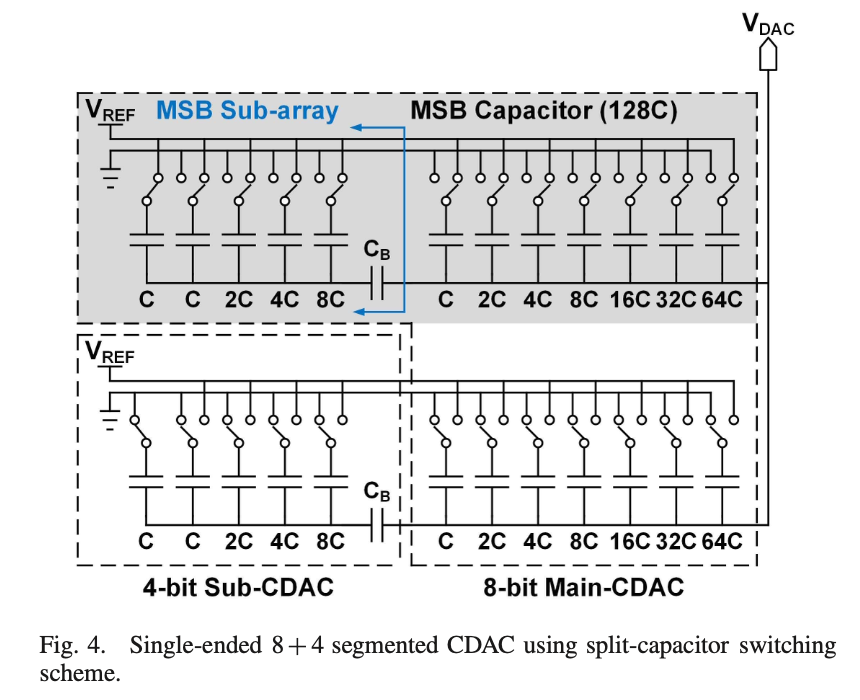
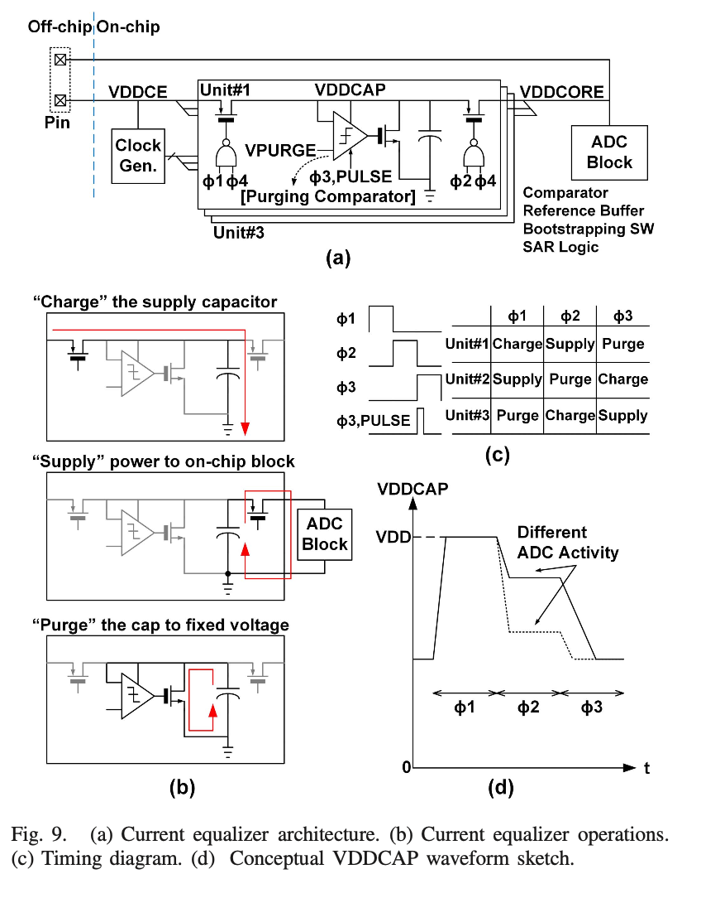

# S2ADC: A 12-bit, 1.25-MS/s Secure SAR ADC With Power Side-Channel Attack Resistance

## abstract

摘要提到 ADC 在做数据转换的时候会暴露硬件漏洞。利用输出和电源电流波形的强相关，可以实施 ADC power side-channel attach (PSA) 攻击，通过接入电源偷取转换结果。本文提供了两种基于神经网络的 SAR ADC PSA 攻击的方法，并提供了一个 12-bit, 1.25-MS/s 的原型 SAR ADC，利用电流平衡抵抗 PSA 攻击。第一个 PSA 手段利用了多层感知机，第二个利用了卷积神经网络。在不进行防范的情况下均可以达到 99% 以上的准确率；防范措施对于 MLP-PSA有极强的作用，对 CNN-PSA 稍弱，但仍然提供了重要的手段。

- PSA？

## Introduction

文中提到揭露ADC漏洞的工作有: 
1. [An Encryption-Authentication Unified A/D Conversion Scheme for IoT Sensor Nodes](https://ieeexplore.ieee.org/document/8579273) A-SSCC 2018
2. [A Random Interrupt Dithering SAR Technique for Secure ADC Against Reference-Charge Side-Channel Attack](https://ieeexplore.ieee.org/document/8653400) ISCAS 2020

文中的模型：

Eavesdropping 部分可以通过数据加密的方式消除（*这里涉及到AES等，需要进一步去看*）。针对数据加密，可以用 PSA 去攻击加密硬件。这一部分在文章参考文献中有解决，主要是 ISSCC 2009 等。直接接触可以用 tamper-proof package 阻止。因此本文针对的部分，即对模拟/数模混合电路的 PSA 攻击有重要性。（*tamper-proof package?*)

SAR ADC 是什么？简单来说，就是用一个 DAC 按照二分查找的方式搜索一个和当前输入的模拟信号接近的数字信号。

## NEURAL-NETWORK-BASED SAR ADC PSA METHODS

## CIRCUIT IMPLEMENTATION AND INFORMATION LEAKAGE SOURCES OF UNPROTECTED SAR ADC

主从的 CDAC 的结构挺有意思。

这个结构非常的有趣，不妨先只考虑下面的部分。4-bit Sub-CDAC 等效于一个看入阻抗为 $1/16j\omega C+1/j\omega C_B$ 的开路电压是 $V_{Sub}$ 电压源，同理另一侧是一个看入阻抗为 $1/127j\omega C$ 的开路电压是 $V_{Main}$ 的电压源。则输出的 $V_{DAC}$ 是：
$$
V_{DAC}=\frac{(1/16C+1/C_B)V_{Main}+(1/127C)V_{Sub}}{1/16C+1/C_B+1/127C}
$$

显然，为了使 Sub 电路起到 LSB 的作用，我们要求
$$
(\frac{1}{16C}+\frac{1}{C_B})\times\frac{V_{REF}}{127}=2^1\times\frac{1}{127C}\times\frac{V_{REF}}{2}
$$

即$C_B=\frac{16}{15}C$。真是太妙了！很难想象这是 JSSC 1970 年代发表的电路。不妨进一步分析一下电路。此时 $V_{DAC}=(127V_{Main}+V_{Sub})/128$，其中 $V_{Main}\in [0,V_{REF}]$，$V_{Sub}\in[0,\frac{15}{16}V_{REF}]$。而图中上半部分对偶的电路看入阻抗一致，唯一的区别在于其 $V_{Sub}\in[\frac{1}{16}V_{REF},V_{REF}]$，这代表着其输出电压最高可以产生 $V_{REF}$ 的电压。这就完全理解了整个电路。

对 PSA 攻击做防御的核心部分是下图的电流均衡器。

这个电路的分析相对平凡，略去。