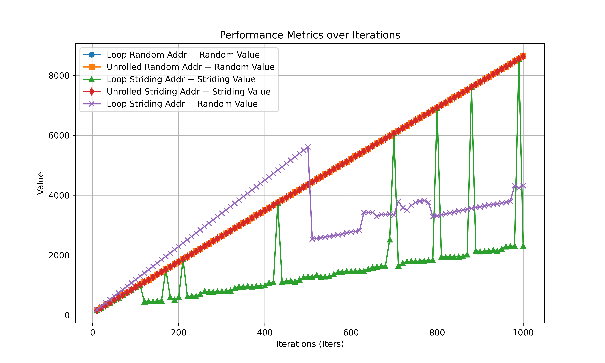

# SLAP: Data Speculation Attacks via Load Address Prediction on Apple Silicon

## Abstract

**利用 Apple 的 Early Load 机制的攻击被做出来了。**

> 自 2018 年 Spectre 首次披露以来，由于难以在硬件中完全缓解推测执行攻击，过去六年中出现了几种新的变体和攻击面。
> 大多数衍生都建立在原始 Spectre 攻击的关键洞察之上，即 CPU 可以在尝试缓解控制冲突（例如条件或间接分支和返回语句）时暂时执行错误的控制流并通过侧信道跟踪泄露机密。
>
> 本文中，我们超越了影响（推测的）控制流，并提出了一种新的数据推测原语，它源于旨在缓解数据风险的微架构优化。
> 更具体地说，我们表明 Apple CPU 配备了加载地址预测器 (LAP)。
> LAP 监控来自相同加载指令的过去地址，以推测性地加载预测地址，该地址可能会错误地指向静止的秘密（即，从未被 CPU 从架构上读取）。
> 一旦检索到秘密，LAP 就会提供一个很大的推测窗口，足以让对手计算秘密，例如通过隐蔽通道泄露秘密。
> 我们展示了 LAP 在最近的 Apple CPU（例如 M2、A15 和更新型号）上的存在。
> 然后，我们通过展示其读取越界、推测性调用恶意函数、破坏 ASLR 和破坏 Safari 网络浏览器的能力来评估 LAP 对安全性的影响。
> 在这里，我们利用 LAP 向远程网络对手披露敏感的跨站点数据（例如来自 Gmail 的收件箱内容）。

<!-- more -->

## Introduction

在已有的对于控制流的推测执行以外，还可以有对于数据流的推测执行。
虽然已经观察到某些形式的此类数据推测，主要是通过数据相关的硬件预取器、存储到加载转发预测或浮点问题，但要完全表征现代 CPU 平台上存在的所有形式的数据推测，还有很多工作要做。

*现代 CPU 上是否存在额外的数据推测机制？*
*如果有，这种推测的安全隐患是什么？*

### 贡献

## Reverse Engineering the LAP

文章很巧妙的利用了时间去推测 LAP 的存在。相较于我之前是土通过 Load Bypass 机制以及后续的暂态执行来逆向，这种方法更加直接也更加有效。

文章首先确认了存在 Load Data Speculation，进一步确认是通过 LAP 实现的。
在此基础上，确认 LAP 的触发条件以及存在基于 LAP 结果的暂态执行。
最终讨论处理器对 LAP 的限制，如 address checks and instruction tagging。

### Observing Load Data Speculation

用 pointer-chasing 构造出一个依赖链，测量 Strding 和 Random 的时间。

*首先 dry-run 一次，全部加载到 cache 避免 prefetching 的影响。*

**为什么会出现drop？**

### Confirming Load Address Prediction

测量 Striding Address from Random Value 的时间。

这里对 iPhone 的处理办法很巧妙：
> However, A-series CPUs are available only on iOS devices, where we do not have access to CPU cycle counters.
> As such, we develop a portable version of the Random, Striding, and SA+RV experiments by compiling them to WebAssembly.
> We then compile the WebAssembly binary to machine code using WebKit, the engine underlying the Safari web browser.
> Since the timer resolution in WebKit is coarse (1 ms), we fix the number of iterations to one million to amplify the timing difference, while keeping the stride unchanged at 32 bytes.

### Confirming Speculative Execution via LAP

误导+FR的方式验证。

注意到：
> For accurate measurements, we require the ability to count cycles and flush cache lines from userspace programs.
> Furthermore, to reduce noise and variation, we require the ability to manually control CPU frequency, isolate CPU cores from being used by operating system processes, and pin programs to the isolated cores.

### Spatial Conditions for Speculation

修改训练序列长度和步长。

### Temporal Conditions for Speculation

在窗口期插入额外的指令。

注意到这里提到了如果 LAP 得到的地址不在 cache 中，会不进行推测。
这和 patent 中的内容是一致的。

### Confirming Instruction Address Tagging

使用全部的 canonical address bits 作为 tag。

## Weaponizing the LAP for Attacks

证明遍历链表激活 LAP 可以劫持控制流和数据流。

### Spectre-LAP

由于预测的地址受制于步长 255 bytes，攻击存在一定的困难。
但是由于预测执行的窗口期很长，我们可以暂态地访问任何地址空间。

可以实现数据和控制流。

## 实验复现

尝试在 Mac mini M2 (t8112) , macOS 15.2 (24C101) 上复现实验。
参考网站 [https://github.com/slap-flop/slap-artifacts]。
由于 OS 有大版本更新，记录和 README 有所不同的部分。

### 打用于获取精确时间打 Kernel 补丁

1. 从 [https://developer.apple.com/download/all/] 下载对应 macOS 版本的 Kernel Debug Kit。
2. 在 Recovery Mode 下关闭 SIP `csrutil disable`，并关闭启动盘的所有安全选项。这一步需要先做，不然无法修改启动参数。
3. 修改启动参数`sudo nvram boot-args="-unsafe_kernel_text"`，避免启动时 kernel panic。
4. 其余按照 README 操作。

### enable-dc-civac 允许对 cache 的操作

1. 首先修改启动参数`sudo nvram boot-args="enable_skstb=1"`，允许对`kern.sched_thread_bind_cpu`的操作。这一步在 README 中没有提到，如果不操作会在运行测试程序时报权限错误。
2. 其余按照 README 操作。

### slap 复现

#### Raw Loop

复现成功。