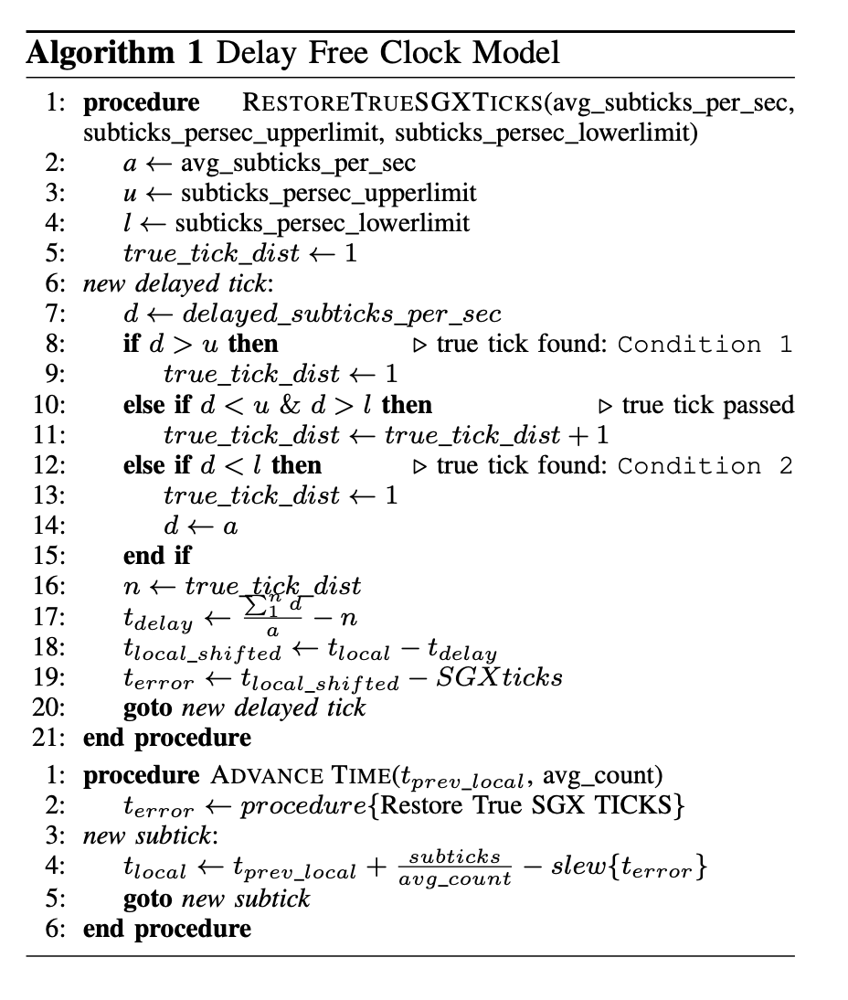

# Securing Time in Untrusted Operating Systems with TimeSeal

可能会做一个相关的项目，读了这篇文章。这篇文章主要关注可信细粒度时间。

<!-- more -->

## 背景

对 time stack 的攻击文章归结为三个部分：
对硬件寄存器的特权写，对时间信息传输过程的延迟，安全的 timekeeping software。

文章认为 SGX 提供的时钟是 trusted 的，但是 coarse-grained。
且文章提出的威胁模型认为 compromised OS 是一个 stealthy attacker。
因此不会打乱时间包的顺序或者丢弃时间包（这里其实比较弱）。
此外，操作系统具有恶意调度的能力（但很快我们会看到由于 stealthy 的原因，这个能力也是有限的）。

## 设计

### 插值获得 fine-grained time

思路很简单，用 一个软件循环递增一个 counter，然后用上一个周期的 counter 增加量来估计当前的时间。
这里会出现由于OS压力的问题导致 counter 增加量不稳定的问题，进而导致不单调的问题。
文章采用了在平台等待的方式，等待的counter增量是由超出量估计得到。

### scheduling attack

这里采用多个 thread 来计数。
为了所谓的 stealthy，这里居然假定在 1 sec 内阻塞所有计时线程是不允许的。

### delay attack

这里采用阈值加误差估计的方式实现。

## rmk

本文其实挺 trivial 的。但是文中提到的一些应用可以参考。